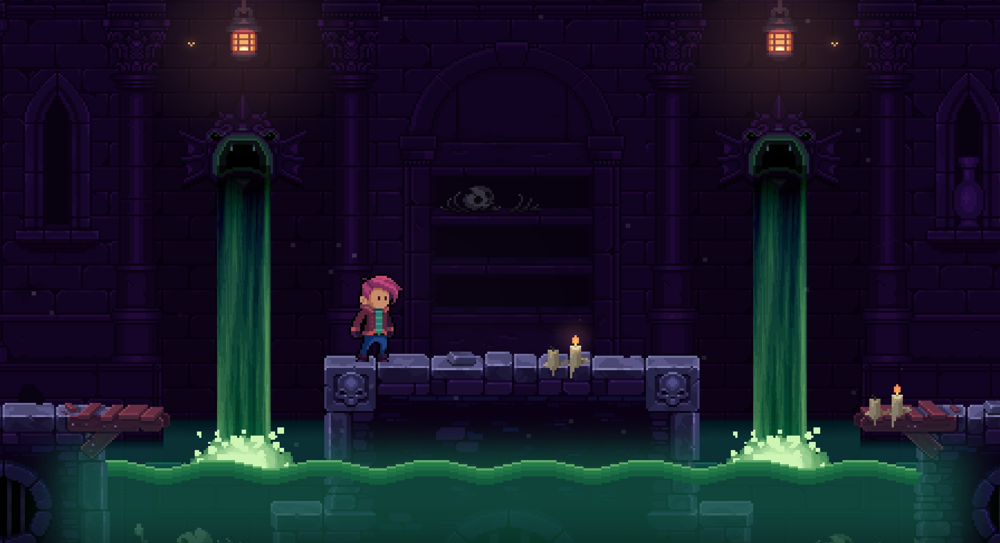

# Deceptus Engine

A C++23/lua-based platformer game engine<br>
It utilizes Box2D for game physics, SFML for rendering, and SDL for game controller support.




# Credits

|What|Who|
|-|-|
|Artwork|dstar|
|Code|mueslee (Matthias Varnholt)|


# How to Build

As the engine uses some C++23 code, you need a recent compiler, i.e.
- gcc >= 13
- Clang >= 15
- MSVC >= 2022

## Linux
```
mkdir deceptus_engine-build
cd deceptus_engine-build
cmake -DCMAKE_BUILD_TYPE=Release ../deceptus_engine
cmake --build .
```

## Windows
```bash
mkdir deceptus_engine-build
cd deceptus_engine-build
cmake -DCMAKE_BUILD_TYPE=Release ..\deceptus_engine
cmake --build .
```

## MacOS

### Building
```bash
brew install fmt
brew install sfml
brew install sdl2
brew install lua
mkdir deceptus_engine-build
cd deceptus_engine-build
cmake -DCMAKE_BUILD_TYPE=Release ../deceptus_engine
cmake --build .
```

### Running
```bash
export PATH="$(brew --prefix fmt)/include:$PATH"
export PATH="$(brew --prefix fmt)/lib:$PATH"

export PATH="$(brew --prefix sfml)/include:$PATH"
export PATH="$(brew --prefix sfml)/lib:$PATH"

export PATH="$(brew --prefix sdl2)/include:$PATH"
export PATH="$(brew --prefix sdl2)/lib:$PATH"

export PATH="$(brew --prefix lua)/include:$PATH"
export PATH="$(brew --prefix lua)/lib:$PATH"

./deceptus
```


# Contribute and Talk to Us!
If you're a musician, graphic artist, level designer or programmer, or just want to hang out and chat, [please join us on Discord!](https://discord.gg/EZpkbGDaWD)


# Designing a Level
[Introduction](doc/level_design/designing_a_level.md#designing-a-level)<br>
[Some Terms](doc/level_design/designing_a_level.md#some-terms)<br>
[Your Tileset](doc/level_design/designing_a_level.md#your-tileset)<br>
[Your Tiles](doc/level_design/designing_a_level.md#your-tiles)<br>
[Level Layers](doc/level_design/designing_a_level.md#level-layers)<br>


## Mechanisms
[Introduction](doc/level_design/mechanisms.md#mechanisms)<br>
[Bouncers](doc/level_design/mechanisms.md#bouncers)<br>
[Conveyor Belts](doc/level_design/mechanisms.md#conveyor-belts)<br>
[Damage Rects](doc/level_design/mechanisms.md#damage-rects)<br>
[Doors](doc/level_design/mechanisms.md#doors)<br>
[Fans](doc/level_design/mechanisms.md#fans)<br>
[Lasers](doc/level_design/mechanisms.md#lasers)<br>
[Bubble Cubes](doc/level_design/mechanisms.md#bubble-cubes)<br>
[Collapsing Platforms](doc/level_design/mechanisms.md#collapsing-platforms)<br>
[Portals](doc/level_design/mechanisms.md#portals)<br>
[Crushers](doc/level_design/mechanisms.md#crushers)<br>
[Death Blocks](doc/level_design/mechanisms.md#death-blocks)<br>
[Levers](doc/level_design/mechanisms.md#levers)<br>
[Sensor Rects](doc/level_design/mechanisms.md#sensor-rects)<br>
[Ropes](doc/level_design/mechanisms.md#ropes)<br>
[Spike Balls](doc/level_design/mechanisms.md#spike-balls)<br>
[Spikes](doc/level_design/mechanisms.md#spikes)<br>
[Spike Blocks](doc/level_design/mechanisms.md#spike-blocks)<br>
[On/Off Blocks](doc/level_design/mechanisms.md#onoff-blocks)<br>
[Rotating Blades](doc/level_design/mechanisms.md#rotating-blades)<br>
[Moving Platform](doc/level_design/mechanisms.md#moving-platform)<br>
[One-Way Walls](doc/level_design/mechanisms.md#one-way-walls)<br>
[Moveable Objects](doc/level_design/mechanisms.md#moveable-objects)<br>
[Extras](doc/level_design/mechanisms.md#extras)<br>
[Dialogues](doc/level_design/mechanisms.md#dialogues)<br>
[Controller Help](doc/level_design/mechanisms.md#controller-help)<br>


## Enemies
[Introduction](doc/level_design/enemies.md#enemies)<br>
[Adding Enemies](doc/level_design/enemies.md#adding-enemies)<br>
[Enemy Design and Properties](doc/level_design/enemies.md#enemy-design-and-properties)<br>
[Generic properties](doc/level_design/enemies.md#generic-properties)<br>
[Arrow Trap](doc/level_design/enemies.md#arrow-trap)<br>
[Bat](doc/level_design/designing_a_level.enemies#bat)<br>
[Blob](doc/level_design/enemies.md#blob)<br>
[Bonefish](doc/level_design/enemies.md#bonefish)<br>
[Cannon](doc/level_design/enemies.md#cannon)<br>
[Critter](doc/level_design/enemies.md#critter)<br>
[Ghost](doc/level_design/enemies.md#ghost)<br>
[Klonk](doc/level_design/enemies.md#klonk)<br>
[Landmine](doc/level_design/enemies.md#landmine)<br>
[Watermine](doc/level_design/enemies.md#watermine)<br>


## Visual Effects
[Introduction](doc/level_design/visual_effects.md#visualization)<br>
[Adding Parallax Layers](doc/level_design/visual_effects.md#adding-parallax-layers)<br>
[Adding Image Layers](doc/level_design/visual_effects.md#adding-image-layers)<br>
[Static Lights](doc/level_design/visual_effects.md#static-lights)<br>
[Dynamic Lights](doc/level_design/visual_effects.md#dynamic-lights)<br>
[Playing with Dynamic Lights / Ropes with Lights](doc/level_design/visual_effects.md#playing-with-dynamic-lights--ropes-with-lights)<br>
[Atmosphere Layers](doc/level_design/visual_effects.md#atmosphere-layers)<br>
[Shader Quads](doc/level_design/visual_effects.md#shader-quads)<br>
[Weather](doc/level_design/visual_effects.md#weather)<br>
[Water Surfaces](doc/level_design/visual_effects.md#water-surfaces)<br>
[Smoke / Fog](doc/level_design/visual_effects.md#smoke-fog)<br>
[Dust](doc/level_design/visual_effects.md#dust)<br>
[Ambient Occlusion](doc/level_design/visual_effects.md#ambient-occlusion)<br>


## Advanced Topics
[Introduction](doc/level_design/advanced_topics.md#advanced-topics)<br>
[Checkpoints](doc/level_design/advanced_topics.md#checkpoints)<br>
[Rooms](doc/level_design/advanced_topics.md#rooms)<br>
[Addendum](doc/level_design/advanced_topics.md#addendum)<br>
[Folder Structure](doc/level_design/advanced_topics.md#folder-structure)<br>


## Creating Your Own Enemies
[Deceptus Engine Lua Interface](doc/lua_interface/readme.md#deceptus-engine-lua-interface)<br>
[Creating Your First Own Enemy](doc/lua_interface/readme.md#creating-your-first-own-enemy)<br>
[Setting Up Your Enemy](doc/lua_interface/readme.md#setting-up-your-enemy)<br>
[Using the API](doc/lua_interface/readme.md#using-the-api)<br>
[The Lua API](doc/lua_interface/readme.md#the-lua-api)<br>
