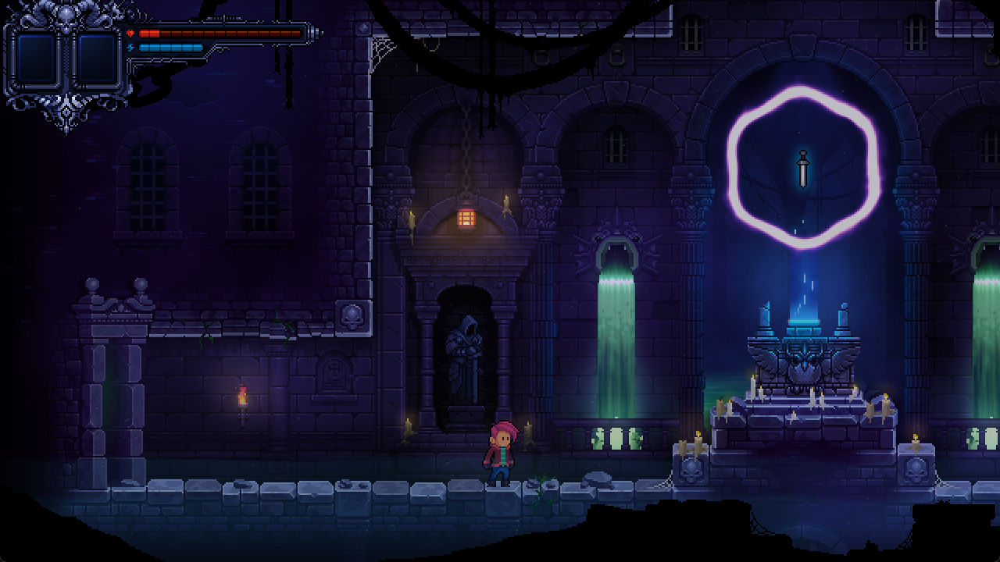
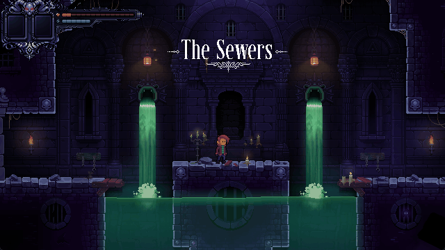

# Deceptus Engine

[](https://github.com/varnholt/deceptus_engine/actions/workflows/windows.yml)
[](https://github.com/varnholt/deceptus_engine/actions/workflows/linux.yml)
[](https://github.com/varnholt/deceptus_engine/actions/workflows/macos.yml)
[](https://github.com/varnholt/deceptus_engine/actions/workflows/wasm.yml)
[](https://github.com/varnholt/deceptus_engine/actions/workflows/switch.yml)

A C++23/lua-based platformer game engine<br>
It utilizes Box2D for game physics, SFML for rendering, and SDL for game controller support.

It builds for Windows, Linux and macOS, it compiles to WebAssembly so it runs in the browser
without a plugin, and it runs on the Nintendo Switch as unsigned homebrew.

### [▶ Play it in your browser on itch.io](https://deceptus.itch.io/deceptus)





The clip above is also available as an [MP4](doc/screenshots/gameplay.mp4) at full resolution.


# Documentation

The complete documentation lives in [doc/readme.md](doc/readme.md). The most travelled paths:

|Topic|Where|
|-|-|
|Designing a level|[designing_a_level.md](doc/level_design/designing_a_level.md)|
|Mechanisms, all 39 of them|[mechanisms.md](doc/level_design/mechanisms.md)|
|Enemies|[enemies.md](doc/level_design/enemies.md)|
|Visual effects, lighting and weather|[visual_effects.md](doc/level_design/visual_effects.md)|
|Writing your own enemies in Lua|[lua_interface/readme.md](doc/lua_interface/readme.md)|
|Cutscenes|[cutscene.md](data/scripts/cutscene.md)|
|Development hotkeys|[development_hotkeys.md](doc/development_hotkeys.md)|


# Credits

|What|Who|
|-|-|
|Artwork|dstar|
|Code|mueslee (Matthias Varnholt)|


# Get a Build

Every push to `master` is built for all five targets. These links always give you the newest
successful build and need no GitHub account:

|Platform|Download|
|-|-|
|Windows|[deceptus-windows.zip](https://nightly.link/varnholt/deceptus_engine/workflows/windows/master/deceptus-windows.zip)|
|Linux|[deceptus-linux.zip](https://nightly.link/varnholt/deceptus_engine/workflows/linux/master/deceptus-linux.zip)|
|macOS|[deceptus-macos.zip](https://nightly.link/varnholt/deceptus_engine/workflows/macos/master/deceptus-macos.zip)|
|Web|[deceptus-wasm.zip](https://nightly.link/varnholt/deceptus_engine/workflows/wasm/master/deceptus-wasm.zip)|
|Nintendo Switch|[deceptus-switch.zip](https://nightly.link/varnholt/deceptus_engine/workflows/switch/master/deceptus-switch.zip)|

The desktop archives contain the executable next to the `data/` directory. On Linux and macOS the
shared libraries come along in `lib/` with a `run.sh` that points the loader at them, so start
those through `run.sh`. The web archive holds the Emscripten output and needs a server that sends
the `COOP`/`COEP` headers described under [Web (WebAssembly)](#web-webassembly). The Switch
archive is a single self-contained `deceptus.nro` with the assets embedded as romfs — it needs a
console running custom firmware, and it has to be started in title takeover mode, as described
under [Nintendo Switch (homebrew)](#nintendo-switch-homebrew).

The links resolve through [nightly.link](https://nightly.link), which hands out the artifact of
the latest successful workflow run. That indirection exists because GitHub only serves Actions
artifacts to signed-in users. If you are signed in you can equally take them straight from the
[workflow runs](https://github.com/varnholt/deceptus_engine/actions).


# How to Build

Only a compiler, CMake and the platform's development headers are needed. SFML 3, SDL 3,
Lua 5.4 and GLEW are downloaded and built by CMake via `FetchContent`; Box2D, ImGui, tinyxml2
and glm are vendored in the source tree.

The engine uses C++23, so the compiler has to be recent. CI builds with gcc 14, MSVC 2022,
Homebrew LLVM and the latest Emscripten. Anything older than gcc 13 or Clang 15 will not do.

## Windows
```bash
cmake -B build -A x64 -DCMAKE_BUILD_TYPE=Release
cmake --build build --config Release --parallel
```

## Linux
```bash
sudo apt-get install -y \
    gcc-14 g++-14 cmake ninja-build \
    libglm-dev \
    libx11-dev libxrandr-dev libxinerama-dev libxcursor-dev libxi-dev \
    libxkbcommon-dev \
    mesa-common-dev libgl-dev libglvnd-dev \
    libasound2-dev libpulse-dev \
    libogg-dev libvorbis-dev libflac-dev libopenal-dev \
    libfreetype-dev libpng-dev \
    libudev-dev

cmake -B build -G Ninja -DCMAKE_BUILD_TYPE=Release \
    -DCMAKE_C_COMPILER=gcc-14 -DCMAKE_CXX_COMPILER=g++-14
cmake --build build --parallel
```

## macOS
```bash
brew install llvm glm ninja

cmake -B build -G Ninja -DCMAKE_BUILD_TYPE=Release
cmake --build build --parallel
```

## Running

The game reads `data/` relative to the working directory, so run it from the repository root:

```bash
./build/deceptus            # Linux, macOS
build\Release\deceptus.exe  # Windows
```

## Web (WebAssembly)

The web build swaps vanilla SFML for [VRSFML](https://github.com/vittorioromeo/VRSFML) and
renders through WebGL 2. It uses pthreads for audio worklets, which means the page has to be
[cross-origin isolated](https://developer.mozilla.org/en-US/docs/Web/API/Window/crossOriginIsolated) —
opening the generated `.html` from `file://` will not work.

With the Emscripten SDK on `PATH`:
```bash
emcmake cmake -B build_wasm -DCMAKE_BUILD_TYPE=Release
cmake --build build_wasm --parallel
```

On Windows, `build_wasm.bat` does the same inside the official `emscripten/emsdk` Docker image,
so no local SDK is needed.

The link step produces `deceptus.html`, `deceptus.js`, `deceptus.wasm` and `deceptus.data`, the
last of which is the whole `data/` directory preloaded into the virtual file system. To play it
locally, `server_wasm.bat` starts a small server on
[localhost:9080](http://localhost:9080/deceptus.html) that sends the required `COOP`/`COEP`
headers.

`emscripten/` holds the hosting shell for the published build: `itch_index.html` is a
player-facing page that shows only the canvas, and `coi-serviceworker.js` establishes
cross-origin isolation on hosts that do not send the headers themselves, itch.io among them.

## Nintendo Switch (homebrew)

The Switch build is an unsigned `.nro` for a console running custom firmware. It reuses the
web build's rendering stack — VRSFML over SDL 3 — because vanilla SFML 3 renders through the
fixed-function pipeline and the Switch's mesa/nouveau driver is core profile only. The SDL
video, joystick and audio backends for the platform are carried as patches under `patches/`.

```bat
build_switch.bat
```

Everything runs in the official `devkitpro/devkita64` Docker image, so no local devkitPro
install is needed. The result is a self-contained `deceptus.nro` with the whole `data/`
directory embedded as romfs.

It boots and plays, on a console as well as in an emulator, and audio is silent so far. On
hardware it has to be launched in title takeover mode — hold R while starting a game from the
HOME menu — or it runs out of memory during asset loading.
[doc/switch_build.md](doc/switch_build.md) has the full setup, how to run and script it in
Ryujinx, and how to work on the port itself.


# Contribute and Talk to Us!
If you're a musician, graphic artist, level designer or programmer, or just want to hang out and chat, [please join us on Discord!](https://discord.gg/EZpkbGDaWD)


# License

The engine and its assets are released under
[Creative Commons Attribution-NonCommercial 4.0 International](LICENSE.md).
