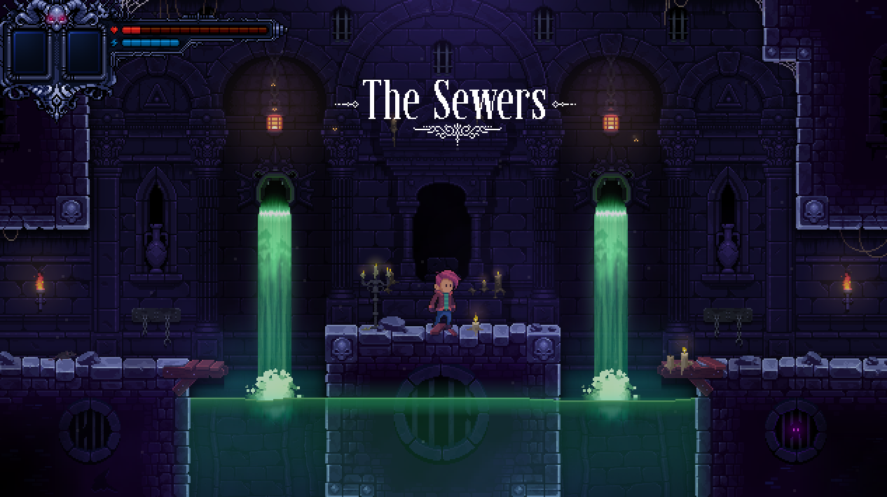

# Deceptus Engine

A C++23/lua-based platformer game engine<br>
It utilizes Box2D for game physics, SFML for rendering, and SDL for game controller support.




# Credits

|What|Who|
|-|-|
|Artwork|dstar|
|Code|mueslee (Matthias Varnholt)|


# How to Build

As the engine uses some C++23 code, you need a recent compiler, i.e.
- gcc >= 13
- Clang >= 15
- MSVC >= 2022

## Linux
```
mkdir deceptus_engine-build
cd deceptus_engine-build
cmake -DCMAKE_BUILD_TYPE=Release ../deceptus_engine
cmake --build .
```

## Windows
```bash
mkdir deceptus_engine-build
cd deceptus_engine-build
cmake -DCMAKE_BUILD_TYPE=Release ..\deceptus_engine
cmake --build .
```

## MacOS

### Building
```bash
brew install fmt
brew install sfml
brew install sdl2
brew install lua
mkdir deceptus_engine-build
cd deceptus_engine-build
cmake -DCMAKE_BUILD_TYPE=Release ../deceptus_engine
cmake --build .
```

### Running
```bash
export PATH="$(brew --prefix fmt)/include:$PATH"
export PATH="$(brew --prefix fmt)/lib:$PATH"

export PATH="$(brew --prefix sfml)/include:$PATH"
export PATH="$(brew --prefix sfml)/lib:$PATH"

export PATH="$(brew --prefix sdl2)/include:$PATH"
export PATH="$(brew --prefix sdl2)/lib:$PATH"

export PATH="$(brew --prefix lua)/include:$PATH"
export PATH="$(brew --prefix lua)/lib:$PATH"

./deceptus
```


# Contribute and Talk to Us!
If you're a musician, graphic artist, level designer or programmer, or just want to hang out and chat, [please join us on Discord!](https://discord.gg/EZpkbGDaWD)

