# Enemies

With the aim to give non-C++ programmers the ability to develop or adjust the behavior of enemies, all enemies were implemented in `lua`. Inside the folder `data/scripts/enemies` you will find a number of scripts you can use as a reference to implement your own enemies or alter their behavior as needed.

The Deceptus Engine offers two ways to integrate enemies inside your level.

## Adding Enemies

In the early days of the Deceptus Engine enemies were added just by defining a huge list of references to the enemy lua scripts bundled together with a couple of properties such as their start positions or the path they move along.

You can configure enemies by editing the json by hand, or - depending on your liking - directly position enemies inside Tiled.

### Adding Enemies with level.json

The first thing to do is to have a json array `enemies` inside your json file.
```json
  "enemies": [

  ]
```

Next, you have to have one section for each enemy instance inside this array. For this purpose you would usually define the '`script`' as well as '`startposition`' of your enemy. The start position is entered in tile coordinates.
```json
    {
      "script": "ghost.lua",
      "startposition": [233, 82],
      "path": [238, 82]
    },
    {
      "script": "bonefish.lua",
      "startposition": [250, 99],
      "path": [250, 99, 256, 99]
    },
```

All properties that are applicable for each enemy type are listed below.

<br>

### Adding Enemies with Tiled

The Tiled approach follows the same concept with the only difference that properties required to configure an enemy are entered through Tiled's Custom Properties. Of course the start position does no longer need to be entered manually since you will just position your enemy inside Tiled.

In order to insert an enemy in your level using the Tiled editor, create an object group called '`enemies`' and insert a rectangle at that location where your enemy should be positioned. Then define all enemy properties inside the Custom Properties, such as


|Custom Property|Type|Description|
|-|-|-|
|script|string|Name of the enemy's lua script|
|path|string|A comma separated list of positions in tile coordinates (x0, y0, x1, y1, etc.)

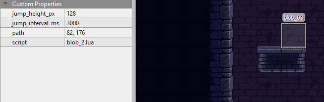

<br>

### Adding Enemies with Tiled and level.json

#### Deprecation note
The approach below is not going to be supported for much longer since you can (and should) define all your objects inside your TMX file.

In order to make things a bit more confusing, there's even a third way to place enemies inside your level. And the choice is really up to you, there's no 'wrong' way to do it. In this method, you just place a rectangle object inside your `enemies` object group and remember its _Object ID_.

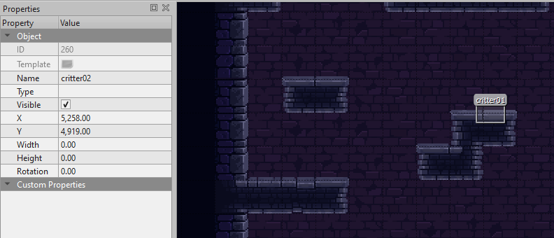

Then, you open up the `level.json` description and add a reference to that object. Now, just add further enemy-related properties to the json as described in the first paragraph of this chapter.

```json
    {
      "script": "critter.lua",
      "id": "260",
      "generate_path" : true
    },
```

Below you will find a description of all enemies including a table of their properties.

<br><br>

## Enemy Design and Properties

<br>

### Generic properties
|Property|Type|Description|
|-|-|-|
|z|int|Layer z index where the enemy is located in. This includes projectiles fired by the enemy.|

<br>

### Arrow Trap

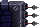

Arrow Traps shoot arrows in a particular direction.

|Property|Type|Description|
|-|-|-|
|script|string|`arrowtrap.lua`|
|alignment|string|Arrow direction: '`up`', '`down`', '`left`', '`right`'|
|time_offset_s|float|An offset for the time when the arrows are fired, given in seconds|

<br>

### Bat

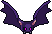

A bat usually sleeps somewhere at the ceiling of a room. When woken up by Adam, it attacks.

|Property|Type|Description|
|-|-|-|
|script|string|`bat_2.lua`|
|script|string|Name of the enemy's lua script|

<br>

### Blob

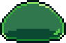

A Blob can either move left and right on the floor or ceiling of a room, jump up and down and actually even jump down and up.

|Property|Type|Description|
|-|-|-|
|script|string|`blob_2.lua`|
|jump_height_px|string|If the Blob should jump, define its jump height in `px`|
|gravity_scale|float|If the Blob should walk the ceiling instead of the floor, you can set its gravity scale to `-1.0`. It'll go positive once the Blob is right over Adam. Then it'll fall down.|
|jump_interval_ms|int|If the Blob should jump, you have to define its jump interval (in `ms`).|
|path|string|Usually you would only define a 2nd x,y-position here which will make the Blob go back and forth between its start position and the other position. You can also enter more than one position if needed. Format: `x0, y0, x1, y1, etc.`|

<br>

### Bonefish

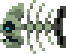

|Property|Type|Description|
|-|-|-|
|script|string|`bonefish.lua`|
|path|string|Usually you would only define a 2nd x,y-position here which will make the Bonefish go back and forth between its start position and the other position. Format: `x0, y0, x1, y1, etc.`|

<br>

### Cannon

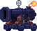

Well... it's a cannon. It fires... cannon balls.

|Property|Type|Description|
|-|-|-|
|script|string|`cannon_2.lua`|
|alignment|string|Cannons either point to the '`left`' or to the '`right`'.|


<br>

### Critter

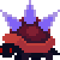

Small spiky enemy that can crawl up walls and simply goes its way round and round and round without ever getting tired.

|Property|Type|Description|
|-|-|-|
|script|string|`critter.lua`|
|generate_path|bool|If `true`, the Deceptus Engine will automatically trace the edge the Critter has been placed on and turn it into a path. Then the Critter will follow this path. This only works for closed loops.|
|inverse_path|bool|If `true`, the inverse path will be generated, i.e. the critter will move the opposite way.|

<br>


### Ghost

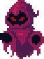

Ghosts fly around following a given path. When Adam gets close by, they try to scare him away.

|Property|Type|Description|
|-|-|-|
|script|string|`critter.lua`|
|path|string|The ghosts path given as a list of x,y-positions; format: `x0, y0, x1, y1, etc.`|

<br>

### Klonk

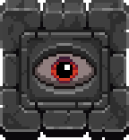

A heavy solid piece of stone that gets angry when Adam is underneath and tries to squash him.

|Property|Type|Description|
|-|-|-|
|script|string|`klonk_2.lua`|


<br>

### Landmine


Ugly piece of technology. When Adam steps onto one of these, it's time to run real quick.

|Property|Type|Description|
|-|-|-|
|script|string|`landmine.lua`|

<br>


### Watermine

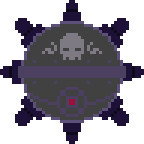

Another ugly piece of technology. Same concept as landmine but underwater.

|Property|Type|Description|
|-|-|-|
|script|string|`watermine.lua`|


<br><br><br>
