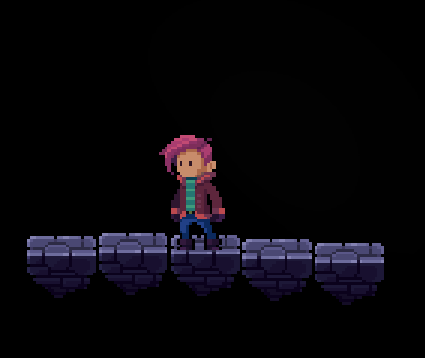
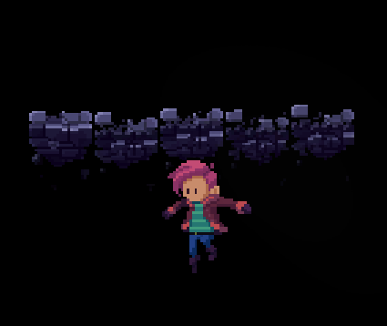
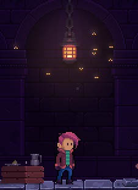
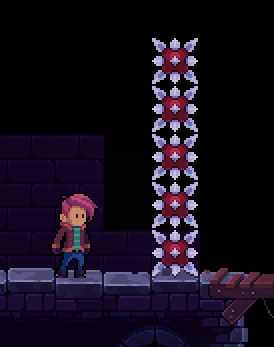
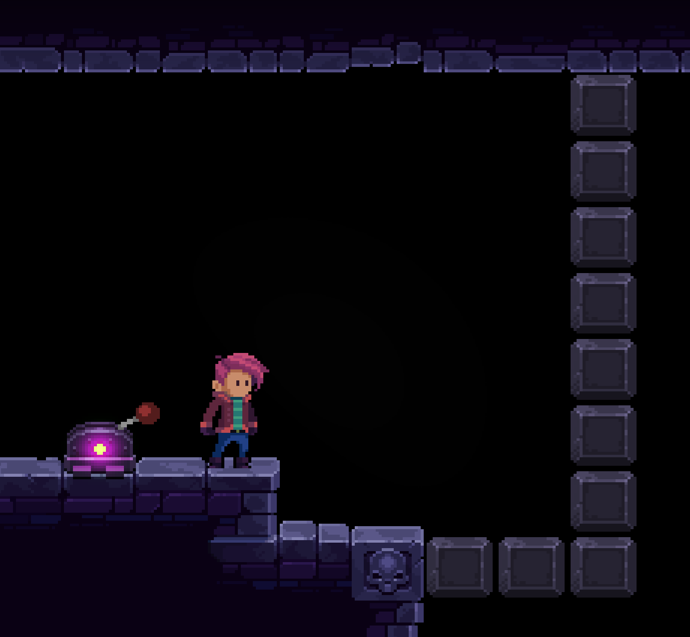
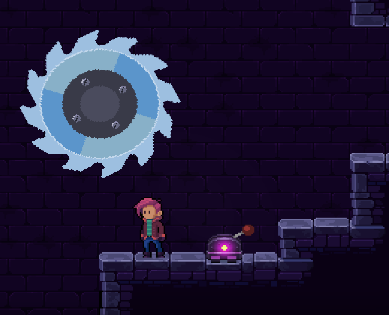

# Mechanisms

The next thing you might want to do is to either add mechanisms to your level or add enemies. With respect to the workflow, both is fine. So you can either jump to the _Enemies_ paragraph or keep reading about mechanisms.

All mechanisms in the game are hard-coded. That means that the only way to change their basic design or behavior by altering the C++ code of the game.

All mechanisms, unless explicitly stated otherwise, use a rectangle object as their basis. This rectangle can either be assigned a particular object type or it can be put into an dedicated object group. Each mechanism description contains a table that contains the values above.

If you put all objects into a separate object group, you can adjust their z index altogether by changing the z index of the object group. If you prefer to put all your mechanisms inside shared object groups, you'll have to set the z index per object.

&nbsp;

---

## Blocking Rects

A blocking rectangle is a textured or untextured (invisible) rectangle the player cannot pass through while it is enabled.
The idea is that there are barriers in a level that are controlled by a Lever mechanism, by a Sensor Rect mechanism, or by the level's script.
Once disabled, the barrier is no longer effective and the player can pass through.
Like most mechanisms, blocking rectangle are created by just drawing a rectangle into its corresponding layer or by assigning the right object type.
The dimensions and position of the blocking area are controlled by the size of the rectangle.

### Object Type / Object Group

|Method|Value|
|-|-|
|Object Type|`BlockingRect`|
|Object Group|`blocking_rects`|


### Object Properties

|Property|Type|Description|
|-|-|-|
|z|int|The object's z index|
|texture|string|Path to the color texture to draw (the default is empty/invisible).|
|normal|string|Path to the normal texture to draw (the default is empty/invisible).|

&nbsp;

&nbsp;

---

## Bouncers

Bouncers allow the player to jump very high or bounce him far into the direction the bouncer points to. At the moment only bouncers pointing up are supported.

Bouncers use the `tilesets/bumper.png` texture inside your level directory.


### Object Type / Object Group

|Method|Value|
|-|-|
|Object Type|`Bouncer`|
|Object Group|`bouncers`|


### Object Properties

|Property|Type|Description|
|-|-|-|
|width|float|The width of the bouncer should be set to `24.0` for horizontally aligned bouncers.|
|height|float|The height of the bouncer should be set to `5.0` for horizontally aligned bouncers.|
|z|int|The object's z index|
---


&nbsp;

&nbsp;

---


## Conveyor Belts

When Adam jumps onto a conveyor belt, he moves along the conveyor belt either to the left or to the right.

The belts have a height of half a tile, their width should be a multiple of 24px.

Conveyor belts use the `tilesets/cbelt.png` texture inside your level directory.

### Object Type / Object Group

|Method|Value|
|-|-|
|Object Type|`ConveyorBelt`|
|Object Group|`conveyorbelts`|

### Object Properties

Now change the object's default properties below:
|Property|Type|Description|
|-|-|-|
|Width|float|The width of the belt should be a multiple of `24.0`.|
|Height|float|The height of the belt should be set to `12.0`.|
|z|int|The object's z index|
|velocity|float|Negative values make the player move to the left, positive values move him to the right. Good values are probably something like `-0.6` and `0.6`.|
---

&nbsp;

&nbsp;

---

## Damage Rects

Damage rects will give the player a configured amount of damage on intersection.

### Object Type / Object Group

|Method|Value|
|-|-|
|Object Type|`DamageRect`|
|Object Group|`damage_rect`|

### Object Properties

|Property|Type|Description|
|-|-|-|
|damage|int|The amount of damage to be given to the player (the default is 100).|

---


&nbsp;

&nbsp;

---


## Doors

Doors are not to be confused with 'Portals'. While the latter teleport you from one place to another, doors serve the purpose of a gate that allows you to move from one room to another.

Doors can have keys assigned the player has to find inside your level (in form of extras). Once the player picks up the corresponding extra, the door may be opened.


### Object Type / Object Group

|Method|Value|
|-|-|
|Object Type|`Door`|
|Object Group|`doors`|

### Object Properties


|Property|Type|Description|
|-|-|-|
|z|int|The object's z index|
|open|bool|Defines the initial state of the door (default is `false`).|
|key|string|If defined, the door can only be opened when the player has the corresponding key. For that reason an extra must be added that has the name of the key.|
|texture|string|A path to a static door texture that is drawn in closed state.|
|sample_open|string|A filename of a sample that is played when the door is opened.|
|sample_close|string|A filenname of a sample that is played when the door is closed.|
|animation_open|string|Name of the 'door open animation' that is configured inside the file `door_animations.json`.|
|animation_close|string|Name of the 'close open animation' that is configured inside the file `door_animations.json`.|
---

&nbsp;

&nbsp;

---
## Fans

Fans work just like fans from the real world, however they are _slightly_ stronger than in the real world. So, depending on where they are pointing to, they can make Adam fly or serve as an impassable obstacle.

This mechanism uses a mix of layers and objects. While the fans inside the tile layer called `fans` determine the direction of the air flow, rectangles in the object layer `fans` or using the object type `Fan` determine the active area of the fans. The idea is that all fans within one rectangle work together as one unit. So when defining the rectangles make sure they nicely overlap with the fan tiles. You can achieve that by using the `ALT`-key inside Tiled.


### Object Type / Object Group

|Method|Value|
|-|-|
|Object Type|`Fan`|
|Object Group|`fans`|

### Object Properties

|Property|Type|Description|
|-|-|-|
|z|int|The object's z index|
|speed|float|The speed value typically ranges from [`0..1`], `0.9` turned out to be a suitable value.|


---

&nbsp;

&nbsp;

---
## Lasers

Lasers follow the same concept as fans and are based on a combination of tiles and objects. Since the tileset allows rather complex laser shapes including mirror tiles, the object layer is used so you can group your laser tiles to one coherent 'unit'.

So the first thing you do is to place all your laser tiles inside a tile layer called `lasers` and then create a rectangle object that covers all the laser tiles that belong together (to one laser group).

### Object Type / Object Group

|Method|Value|
|-|-|
|Object Type|`Laser`|
|Object Group|`lasers`|

### Object Properties

|Property|Type|Description|
|-|-|-|
|z|int|The object's z index|
|off_time|int|The duration the laser is in 'off' state (in ms)|
|on_time|int|The duration the laser is sin 'on' state (in ms)|


### Moving Lasers

To make lasers a little more interesting, there's also the option to make them movable. For that purpose, you can define a polygon inside your lasers layer that defines the movement path.
All you need to do is to give your laser object a name, and then reference that object in your polygon's properties.

|Property|Type|Description|
|-|-|-|
|reference_id|string|The object name of the rectangle that groups your laser tiles|
|movement_speed|float|A velocity factor for the laser movement, the default is `0.2`.|
|z|int|The object's z index|

---

&nbsp;

&nbsp;

---
## Bubble Cubes

Bubble Cubes serve as a solid platform the player can land on and jump off again. However, once the player contact to the Bubble Cube ends, it pops and only respawns after a couple of seconds.

The rectangle object's dimensions (including margin) are 3 x 2 tiles so it makes sense to adjust your rectangle accordingly.


### Object Type / Object Group

|Method|Value|
|-|-|
|Object Type|`BubbleCube`|
|Object Group|`bubble_cubes`|

### Object Properties

|Property|Type|Description|
|-|-|-|
|animation_offset_s|float|An offset for the bubble animation (in seconds), so they're not in sync. The default value is `0s`.|
|pop_time_respawn_s|float|The time elapsed until the bubble respawns (the default is `3s`).|
|move_down_velocity|float|Controls the movement velocity when the player is standing on the bubble (the default is `0.5`).|
|move_up_velocity|float|Controls the movement velocity (back up) when the player is no longer standing on the bubble (the default is `0.5`).|
|maximum_contact_duration_s|float|If configured, bubbles will pop after the given duration is elapsed (the default is `undefined`).|
|z|int|The object's z index|

---

&nbsp;

&nbsp;

---

## Collapsing Platforms

Collapsing Platforms behave similar to Bubble Cubes. As soon as the player steps onto them, they start shaking for a while, then they collapse.
A little later, they respawn.

In order to place Collapsing Platforms in your level, create an object layer called `collapsing_platforms`.
In there, just place a rectangle where you'd like to position your Collapsing Platform. Make sure that the rectangle height is one tile and its width a multiple of n tiles.




### Object Type / Object Group

|Method|Value|
|-|-|
|Object Type|`CollapsingPlatform`|
|Object Group|`collapsing_platforms`|

### Object Properties

|Property|Type|Description|
|-|-|-|
|time_to_collapse_s|float|The time in seconds it takes for a platform to collapse (the default is 1.0s).|
|destruction_speed|float|A factor for the destruction play speed (the default is 30.0).|
|fall_speed|float|A factor for the fall speed of the blocks (the default is 6.0).|
|time_to_respawn_s|float|The time in seconds it takes for a collapsing platform to respawn (the default is 4.0s).|
|fade_in_duration_s|float|The time in seconds it takes for a respawning platform to fade in (the default is 1.0s).|
|z|int|The object's z index|

---

&nbsp;

&nbsp;

---

## Fireflies

Well. Fireflies should be glowing on their own. What's been implemented here is rather a bunch of flies flying around a lantern in an 8 shape. So it's a terrible name choice for this mechanism. Let's hope that nobody really notices / cares.

In order to add the Fireflies effect to your level, create an object layer called `fireflies`.
In there, just place a rectangle where you'd like to position and scale the effect. To make the effect more convincing, it might be a good idea to place a `fireflies` layer in front, and another one behind the lantern. 



### Object Type / Object Group

|Method|Value|
|-|-|
|Object Type|`Fireflies`|
|Object Group|`fireflies`|

### Object Properties

|Property|Type|Description|
|-|-|-|
|animation_speed|float|This setting controls the sprite animation speed. The default is 3.0.|
|scale_horizontal_max|float|This is the maximum scale an 8 shape can have in horizontal direction. The default is 1.0, anything above will exceed the rectangle width.|
|scale_horizontal_min|float|This is the minimum scale an 8 shape can have in horizontal direction. The default is 1.0, very small values will make the movement look like a horizontal line.|
|scale_vertical_max|float|This is the maximum scale an 8 shape can have in vertical direction. The default is 1.0, anything above will exceed the rectangle height.|
|scale_vertical_min|float|This is the minimum scale an 8 shape can have in vertical direction. The default is 1.0, very small values will make the movement look like a vertical line.|
|speed_max|float|This is them maximum speed a single firefly can have. The default is a random value between 1 and 2.|
|speed_min|float|This is them minimum speed a single firefly can have. The default is 1.|
|count|int|This controls the amount of fireflies to be drawn. The default is 1.|
|z|int|The object's z index|

---

&nbsp;

&nbsp;

---


## Portals

Portals can teleport Adam from one location to another. For that reason, they give you a lot of freedom in your level design possibilities since you can have a coherent level, even though your individual rooms are distributed all over the map.

When the player enters a portal, a transition animation - like a fade-out/fade-in - is played so the viewer has no idea of what is happening behind the curtains.

In order to create portals, first create a tile layer called `portals` where you place your portal tiles. Then, in an object layer, also called `portals`, you draw a polyline from the center of one portal to another. Now they are linked and the player can go back and forth between them. The first position of the polyline is the entrace, the 2nd position is the exit. Therefore, an exit also be an entrace to another portal. If you only draw a single polyline between two portals, it's just a simple two-way mechanism.


In the screenshot above, Adam enters at the top left, exits at the bottom right, and when he enters again, teleports to the top right.

---

&nbsp;

&nbsp;

---

## Crushers

As the name promises, Crushers can crush Adam. They consist of a bunch of spikes connected to a heavy weight that moves to one direction with high velocity and then retracts again.


### Object Type / Object Group

|Method|Value|
|-|-|
|Object Type|`Crusher`|
|Object Group|`crushers`|

### Object Properties

|Property|Type|Description|
|-|-|-|
|alignment|string|Direction of the Crusher (valid values are '`up`', '`down`', '`left`', '`right`')|
|z|int|The object's z index|

---

&nbsp;

&nbsp;

---

## Death Blocks

Death Blocks are spiky boxes that move back and forth along a given line. Depending on your tilesheet the direction of the Death Block's rails is either horizontal, vertical, but can actually be any arbitrary angle.


Since you draw the 'rails' of the Death Blocks just to a background layer, this mechanism only requires you to create a polyline object.

### Object Type / Object Group

|Method|Value|
|-|-|
|Object Type|`DeathBlock`|
|Object Group|`death_blocks`|

### Object Properties

|Property|Type|Description|
|-|-|-|
|z|int|The object's z index|

---

&nbsp;

&nbsp;

---


## Levers

Levers! One of the most important mechanisms. In short, they do what levers do: They switch things on and off. Levers can be used to enable and disable the functionality of these mechanisms:
- Conveyor Belts
- Doors
- Fans
- Lasers
- On/Off Blocks
- Platforms
- Rotating Blades
- Spikes
- Spike Blocks

While you draw your lever objects as 3x2 tile rectangles, a connection between another mechanism and the lever is created by adding an object group `switchable_objects`; in there you draw a rectangle that covers both the object(s) that should be switched on and off as well as the lever.


In the screenshot above the fans will go off once the lever is activated.

The properties below apply for the object inside the `levers` object group.

### Object Type / Object Group

|Method|Value|
|-|-|
|Object Type|`Lever`|
|Object Group|`levers`|

### Object Properties

|Property|Type|Description|
|-|-|-|
|enabled|bool|Defines the initial state of the lever which is either enabled or disabled|
|z|int|The object's z index|
|target_id|string|An optional name of the object controlled by this lever. This can be used if you don't to use the 'switchable_objects' approach.|
|target_ids|string|An semicolon separated list of object names for objects that are controlled by this lever. This can be used if you don't to use the 'switchable_objects' approach.|

---

&nbsp;

&nbsp;

---


## Sensor Rects

Sensor Rectangles work pretty much like a photo sensor. They have no visualization. All they do is enable, disable or toggle another mechanism when the player is either entering or leaving a pre-defined area.

This can come handy when you want to always trigger a switch when the player enters a room or always close a door when the player just walked through it.
So you can build quite complex mechanisms with this while the mechanism itself is very easy to use.

### Object Type / Object Group

|Method|Value|
|-|-|
|Object Type|`SensorRect`|
|Object Group|`sensor_rects`|

### Object Properties

|Property|Type|Description|
|-|-|-|
|reference_id|string|The object identifier that the sensor is connected to.|
|event|string|The event that triggers the action. This can either be `on_enter` (default) or `on_leave`. |
|action|string|Whether to `enable`, `disable`, or `toggle` the other reference mechanism. Valid values are `enable` (default), `disable`, `toggle`.|
|z|int|The object's z index|

---

&nbsp;

&nbsp;

---


## Ropes

The Deceptus Engine is able to connect other objects to ropes attached to mounts. So far this is only used for visual effects, later on - if there is any demand - the Engine can be extended to allow the player to hold on to the rope or attach other objects to it.

Moreover, ropes have a number of properties to simulate 'wind behavior'. So you can also place them next to open windows out outside areas.

### Object Type / Object Group

|Method|Value|
|-|-|
|Object Type|`Rope`|
|Object Group|`ropes`|

### Object Properties

|Property|Type|Description|
|-|-|-|
|push_interval_s|float|The interval how often the rope is pushed (in seconds, a good value is `5.0`)|
|push_duration_s|float|The duration for how long the rope is pushed (in seconds), a good value is `1.0`|
|push_strength|float|The amount of force to be applied for each frame during the push duration (`0.01` is a good value)|
|segments|int|The amount of segments your rope should have (less is better, `7` is a good value)|
|z|int|The object's z index|

Read more about Ropes in the paragraph 'Ropes with Lights'.

---

&nbsp;

&nbsp;

---


## Spike Balls

Spike Balls are nasty. They're heavy balls with spikes connected to a chain which move from left to right and back. Adam can either duck or jump to make his way past them, however it requires a little practice to master them.


In order to add Spike Balls to your level, you have to create a rectangle object at the location where the Spike Ball's chain shall be mounted.

It is very important to place that mount high enough, otherwise the ball will crash into the physics representation of your level and the physics engine will go a bit crazy.

### Object Type / Object Group

|Method|Value|
|-|-|
|Object Type|`SpikeBall`|
|Object Group|`spike_balls`|

### Object Properties

|Property|Type|Description|
|-|-|-|
|z|int|The layer's z index|
|push_factor|float|Each time when the spike ball changes direction, it gets a little push. This is the factor for the force that's applied (default is `0.625`).|
|spline_point_count|int|Chain elements are drawn as a spline so they don't look like a bunch of concatenated edges. This defines the number of elements (default is `25`).|
|chain_element_count|int|The amount of chain elements used for the chain. The default is `10` elements.|
|chain_element_distance_m|float|The distance between chain elements, given in metres. The default is `0.3m`.|
|chain_element_width_m|float|The height of a chain element in metres, the default is `0.06m`.|
|chain_element_height_m|float|The width of a chain element in metres, the default is `0.0125m`.|

---

&nbsp;

&nbsp;

---


## Spikes

Sharp spikes moving out of the ground are making Adam's life even harder. There are three types of spikes:
- Interval Spikes: They extend and retract in 2 second intervals.
- Trap Spikes: They extend upon contact after 250ms.
- Toggle Spikes: Those are enabled or disabled using a lever.

In order to create any of the spike types above, create a tile layer named `toggle_spikes`, `trap_spikes`, or `interval_spikes`. Then draw your spike tiles into any of these layers as needed.

If you do not know how levers work, you can read more about that in the description of the 'Lever' mechanism.

As a side-note. If you want spikes that are extended, just put them into your `toggle_spikes` layer and don't create a connection to any lever.


### Object Properties

|Property|Type|Description|
|-|-|-|
|z|int|The layer's z index|

---

&nbsp;

&nbsp;

---


## Spike Blocks



Spike Blocks are small, nasty barriers that  - once extracted - the player cannot easily get past. Usually they are placed in groups, such as rows or columns, but they can be positioned in arbitray shapes. They come in two different modes: Either their state is controlled via the Lever Mechanism, or they extract and retract in given intervals. That's the interval mode.

While they are in lever mode without actually being connected to a lever, they are always extracted.

If you need to know how to connect Spike Blocks to a lever, please check the documentation about the Lever Mechanism.

To create a Spike Block, just create a rectangle object of 1x1 tiles for each block.

### Object Type / Object Group

|Method|Value|
|-|-|
|Object Type|`SpikeBlock`|
|Object Group|`spike_blocks`|

### Object Properties

|Property|Type|Description|
|-|-|-|
|z|int|The layer's z index|
|enabled|bool|The default enabled state (default is `true`)|
|mode|string|The Spike Block's mode, either '`interval`' or '`lever`' (default is '`lever`')|
|time_on_ms|int|When mode is '`interval`', the time the Spike Block is extracted, given in ms (default is 4000ms)|
|time_off_ms|int|When mode is '`interval`', the time the Spike Block is retracted, given in ms (default is 3000ms)|

---

&nbsp;

&nbsp;

---


## On/Off Blocks

On/Off Blocks are basically the friendly version of the Spike Block. When you switch it on, it's just a solid block that could be placed as a barrier, ladder, etc.
When you switch it off, it just disappears and the player does no longer collide with them.

To create an On/Off Block, just create a rectangle object of 1x1 tiles for each block.



### Object Type / Object Group

|Method|Value|
|-|-|
|Object Type|`OnOffBlock`|
|Object Group|`on_off_blocks`|

### Object Properties

|Property|Type|Description|
|-|-|-|
|z|int|The layer's z index|
|enabled|bool|The default enabled state (default is `true`)|
|mode|string|The Spike Block's mode, either '`interval`' or '`lever`' (default is '`lever`')|
|time_on_ms|int|When mode is '`interval`', the time the Spike Block is extracted, given in ms (default is 4000ms)|
|time_off_ms|int|When mode is '`interval`', the time the Spike Block is retracted, given in ms (default is 3000ms)|

---

&nbsp;

&nbsp;

---


## Rotating Blades

Rotating Blades are pretty nasty. They're pretty much the same as an angle grinder with a very sharp blade attached to it. So don't run into it while it's rotating - collision means instant death.



To create a rotating blade object, just create a polyline for its path.

### Object Type / Object Group

|Method|Value|
|-|-|
|Object Type|`RotatingBlade`|
|Object Group|`rotating_blades`|

### Object Properties

|Property|Type|Description|
|-|-|-|
|z|int|The layer's z index|
|enabled|bool|The default enabled state (default is `true`)|
|blade_acceleration|float|The acceleration used for the blade to gain speed (both in rotation and vertical/horizontal movement) when enabled (the default is `0.006`).|
|blade_deceleration|float|The deceleration used for the blade to drop speed (both in rotation and vertical/horizontal movement) when disabled (the default is `0.009`).|
|blade_rotation_speed|float|The value that is applied to the rotation of the blade sprite. The higher, the faster the rotational movement (the default is `400.0`).|
|movement_speed|float|A factor applied to the horizontal/vertical movement of the blade. The higher, the faster the blade moves around (the default is `0.2`). |

---

&nbsp;

&nbsp;

---


## Moving Platform

Moving Platforms are platforms that follow a certain path inside your level. They can be used just like an elevator or for any other purpose, like moving over a couple of deadly spikes, etc.


To create moving platforms, the first thing to do is to draw your platform rail tiles into any background tile layer so know which path the platform is supposed to follow. This is only an optical change to your level since the actual path your platform will follow is defined in an object group called `platforms`. Therefore the next step is to create this object group and to draw a polyline from start to end. The last thing to do is to create the actual platform. That's done by simply placing a rectangle into the same layer which overlaps the path you defined in the previous step. The width should be a multiple of `24px` and the height should be `12px`.


### Object Type / Object Group

|Method|Value|
|-|-|
|Object Type|`Platform`|
|Object Group|`platforms`|

### Object Properties

|Property|Type|Description|
|-|-|-|
|z|int|The object's z index|

---

&nbsp;

&nbsp;

---

## One-Way Walls

When making the decision to build a platform game engine on top of a realistic physics system such as Box2D, the need to have one-way walls is - from the software developer perspective - the greatest imaginable pain in the ass. Anyway, they're implemented. You are welcome.

If you ever played any Mario title in your life, you will know what a one-way wall is. The concept is very simple: The player jumps up, the player passes through the wall. The player starts falling down again, the wall becomes solid.

Like the `level` tile layer, there's also a layer for tiles with one-way behavior. It is called `level_solid_onesided`. When designing the shape of these tiles in Tiled's 'Tile Collision Editor', they should be defined as boxes with a height of 1px and a width of 24px:


So once all the tile shapes are set up, they can be drawn into the tile layer. When that's done, it is possible to debug the generated physics shapes in the game by pressing `F1`.


While the player moves through the one-way walls by pressing the jump key / button, it is possible to drop from a one-way wall by pressing jump together with the down key / button.

### Object Type / Object Group

|Method|Value|
|-|-|
|Object Type|`n/a`|
|Object Group|`level_solid_onesided`|

### Object Properties

|Property|Type|Description|
|-|-|-|
|z|int|The layer's z index|

---

&nbsp;

&nbsp;

---

## Moveable Objects

At the moment this object type should rather be called 'Moveable Box' since their (rectangular) shape and texture is hardcoded. However, that might change in the future.

Anyhow, Moveable Objects are objects the player can push from one position to another just by walking against it. This way Adam might be able to climb obstacles, block enemies, etc.

The way to create a moveable object, create a rectangle as usual. So far the sprite set supports 24x24px and 48x48px boxes. Depending on the size of your rectangle object, the right texture is selected.


### Object Type / Object Group

|Method|Value|
|-|-|
|Object Type|`MoveableObject`|
|Object Group|`moveable_objects`|

### Object Properties

|Property|Type|Description|
|-|-|-|
|z|int|The layer's z index|


---

&nbsp;

&nbsp;

---

## Extras

Extras are nothing but generic string attributes that are passed to the player. I.e., you define a rectangle inside your level, and when the player intersects with that rectangle, the extra is passed to the player. Extras can be keys for doors, or upgrades for players. While doors are able to simply check whether a player has a certain extra, upgrades (such as weapons or power-ups), are usually passed to the player in the `level.lua` script.   
Inside the lua script, the power-up logic is defined. Below is an example of an extra called 'sword' being evaluated and then passed to the player:

```lua
function playerReceivedExtra(extra)
   -- enable all blocking rects once player picked up diving suit
   if (extra == "sword") then
      giveWeaponSword()
   end
end
```


### Object Type / Object Group

|Method|Value|
|-|-|
|Object Type|`Extra`|
|Object Group|`extras`|

### Object Properties

|Property|Type|Description|
|-|-|-|
|z|int|The layer's z index|
|texture|string|Path to a static texture that represents the extra. If an 'animation_main_0' is defined as described below, the same texture dimensions are applied as used by the animation.|
|sample|string|Name of an audio file that is played on collision with the extra|
|animation_pickup|string|Name of the animation shown when the extra is picked up. The animation cycle is defined inside the file `extra_animations.json`.|
|animation_main_0 to animation_main_99|string|Names of the animation cycles shown when the extra is not picked up yet. The animation cycles are defined inside the file `extra_animations.json`. By allowing multiple cycles here, you can introduce a bit of variety instead of cycling the same dull idle animation over and over again.|


&nbsp;

&nbsp;

---

## Dialogues

The Deceptus Engine can display message boxes which are shown when the player is inside a defined area and presses a button to activate the message box.
This is usually the `up` button of your keyboard or dpad.


The message boxes can vary in color and can contain multiple messages.
In the future they might be extended so they can alter in location, color and animation.

In order to introduce a message box, you create a rectangle object that defines the area where a message box is shown when activated.


### Object Type / Object Group

|Method|Value|
|-|-|
|Object Type|`Dialogue`|
|Object Group|`dialogues`|

### Object Properties

|Property|Type|Description|
|-|-|-|
|01|string|The first message to show|
|02|string|The second message to show|
|03|string|The third message to show|
|..|...|...|
|nn|string|The nth message to show, you get the idea...|
|nn_x_px|int|The x offset of the message box on the screen (optional). `nn` is the number of the message the offset refers to. The screen dimensions are `640` x `360`.|
|nn_y_px|int|The y offset of the message box on the screen (optional). `nn` is the number of the message the offset refers to. The screen dimensions are `640` x `360`.|
|nn_text_color|color|The text color of the message box; if not set, the color previously set will be used. `nn` is the number of the message the text color refers to.|
|nn_background_color|color|The text color of the message box; if not set, the color previously set will be used. `nn` is the number of the message the background color refers to.|
|open_automatically|bool|The dialogue open just on collision with the player, no button needs to be pressed.|

Moreover, you can use the tags below inside your dialogue strings:

|Keyword|Description|
|-|-|
|`<br>`|Add a line break|
|`<player>`|Insert the name of the player|

---

&nbsp;

&nbsp;

---


## Controller Help

When you're designing tutorial levels that should introduce the user to the basic game controls, it makes sense to visualize those controls inside the level.
E.g. when the player has to press a certain button to open a door etc. the related button could be indicated.

You do so by creating a layer called `controller_help` and inserting rectangles in there for those areas where help should be shown.


### Object Type / Object Group

|Method|Value|
|-|-|
|Object Type|`ControllerHelp`|
|Object Group|`controller_help`|

### Object Properties


|Property|Type|Description|
|-|-|-|
|keys|string|A semicolon delimited string that lists the key/button combinations to be shown|
|z|int|The object's z index|

### Available Keys

||0|1|2|3|4|5|6|7|8|9|10|11|12|13|14|15|
|-|-|-|-|-|-|-|-|-|-|-|-|-|-|-|-|-|
|0|`key_esc`|`key_1`|`key_2`|`key_3`|`key_4`|`key_5`|`key_6`|`key_7`|`key_8`|`key_9`|`key_minus`|`key_equals`|`key_backspace`||||`
|1|`key_tab`|`key_q`|`key_w`|`key_e`|`key_r`|`key_t`|`key_y`|`key_u`|`key_i`|`key_o`|`key_p`|`key_bracket_l`|`key_bracket_r`||||`
|2|`key_caps`|`key_a`|`key_s`|`key_d`|`key_f`|`key_g`|`key_h`|`key_j`|`key_k`|`key_l`|`key_semicolon`|`key_apostrophe`|`key_return`||||`
|3|`key_shift`|`key_0`|`key_z`|`key_x`|`key_c`|`key_v`|`key_b`|`key_n`|`key_m`|`key_comma`|`key_period`|`key_question`|`key_backslash`||||`
|4|`key_ctrl`|`key_win`|`key_alt`|`key_empty`|`key_list`|||||`key_cursor_l`|`key_cursor_u`|`key_cursor_d`|`key_cursor_r`||||`
|5|`bt_a`|`bt_b`|`bt_x`|`bt_y`|`bt_list`|`bt_menu`|`bt_rt`|`bt_lt`|`bt_lb`|`bt_rb`|||||||`
|6|`dpad_u`|`dpad_d`|`dpad_l`|`dpad_r`|`bt_u`|`bt_d`|`bt_l`|`bt_r`|`bt_1`|`bt_2`|`bt_3`|`bt_4`|`bt_5`|`bt_6`|`bt_7`|`bt_8`|`
|7|`bt_r_u`|`bt_r_d`|`bt_r_l`|`bt_r_r`|`bt_r_u_d`|`bt_r_l_r`|`dpad_empty`|`bt_0`|`bt_9`|`bt_10`|`bt_11`|`bt_12`|`bt_13`|`bt_14`|`bt_15`|`bt_16`|`
|8|`bt_l_u`|`bt_l_d`|`bt_l_l`|`bt_l_r`|`bt_l_u_d`|`bt_l_l_r`|||||||||||`

Depending on whether a keyboard or a game controller is connected, the buttons below will be mapped as follows:

|Key|Button|
|-|-|
|`key_cursor_u`|`dpad_u`|
|`key_cursor_d`|`dpad_d`|
|`key_cursor_l`|`dpad_l`|
|`key_cursor_r`|`dpad_r`|
|`key_return`|`bt_a`|
|`key_escape`|`bt_b`|

---

&nbsp;
