# Designing a Level

Levels in Deceptus use the Tiled Editor file format _tmx_.
In order to make your first level you will need two things:
Tiled and a solid sprite sheet, also called tileset.

<br>

## Some Terms
A _sprite sheet_ is a big texture (an image) that contains all the elements that you want to use in your level. Those are called _sprites_.<br>
You can use as many sprite sheets as you like, however Deceptus only supports one sprite sheet per _layer_.
A layer is something like a transparent sheet where you can draw things on. And you can put as many of these sheets on top of each other, all combined resulting into one final image.<br>
Likewise, your level can consist of many layers put on top of each other.
So you can have a layer for things that should always be in the foreground, another layer for all the stuff that's directly located around our game character and another layer for the background. While writing this, our hero does not have a name yet, so let's just call him Adam for now.

<br>

## Your Tileset

Each game defines a particular tile size (the width and height) of a tile in the sprite sheet. Deceptus went for `24x24px`. If you want to go for a different tile size, you'd have to change the code of the game (`constants.h`).<br>
Furthermore, we have decided that 2 tiles should represent 1m in the 'real world'. This is relevant for the physics behavior of the game. So it's good to keep in mind that 48 pixels are equivalent to 1 meter. This constant can also be altered in the game code if needed.

<br>

## Your Tiles

Deceptus differentiates between _colliding_ and _non-colliding_ tiles. The latter are tiles that are just drawn onto the screen. They don't have any other influence on the behavior of the game. Colliding tiles on the other hand are those tiles Adam is standing on or bouncing into such as the floor, the walls, etc.<br>
Tiled comes with a 'Tile Collision Editor' where you can define the shape of each tile. This is either a simple rectangle, but it can also be a more complex polygon. That's really up to your level design. In any case, defining the shape of the colliding tiles is probably the first chore that you have to do when starting the design of a level.

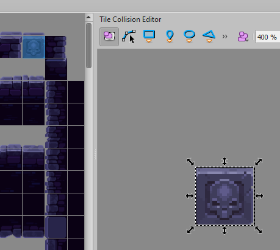

Keep in mind that the shapes used for each tile will be merged into one big 2D model ('mesh') later on. The merging step only works if the polygons are really accurate. The mesh optimizer used here will create 2 edges instead of 1 if a point of your polygon (vertex) is off by just 1px. To make sure that your vertices really align with each other, it is recommended to open up the tmx file in a text editor and compare if the values match:

```xml
  <tile id="74">
   <objectgroup draworder="index" id="2">
    <object id="1" x="0" y="0" width="24" height="24"/>
   </objectgroup>
  </tile>
  <tile id="75">
   <objectgroup draworder="index" id="2">
    <object id="1" x="0" y="0" width="24" height="24"/>
   </objectgroup>
  </tile>
```

## Level Layers

### A First Test Run

The first thing you want to do next is to define the colliding layer of your level because once you've done that, you are actually able to try it out inside the game engine.

This layer _must_ be called 'level' and it should have a custom property of type `int` with the value `15`. More on that later.

When you save the tmx file the game will evaluate all the collision information that you defined in the Collision Editor, merge that to one large mesh and pass that to the physics engine.

Now you've got to define a JSON file that describes the most basic information about your level, such as
- the filename of your level
- Adam's start position

To do so, create a subdirectory inside the game's `data` folder such as `level-awesome` and copy your tmx file and all related files such as your sprite sheets etc. to this folder. Now create a file called `level.json` that looks like the one below:

```json
{
  "filename": "data/level-awesome/my_awesome_level.tmx",
  "startposition": [45, 27]
}
```

The `filename` property just points to your tmx file.<br>
The `startposition` property is a x, y array that defines Adam's start position. This position is in tile coordinates. You can see the tile coordinates at Tiled's status bar at the bottom. This is why it's been decided that tile coordinates are more convenient than pixel coordinates.

The last step needed to be finally able to play your first level is to define the order of your levels. For that purpose, open up `data/config/levels.json` and create a section for your level. If you put it first, it will load right after you start a new game:

```json
[
   {
      "levelname": "data/level-awesome/level.json"
   },
   ...
]
```

Now you're all set! Go and try out your first level!

Check out the addendum for more info about the overall folder structure of the Deceptus Engine.

<br>

### Adding More Layers

Of course, having a single layer level will look a bit dull so you're probably interested in how to add layers to the foreground and background.

Deceptus currently supports 51 layers while the layer furthest away from your eye (in the background) has the z coordinate `0` and the frontmost layer has the z coordinate `50`. Adam moves around on `z = 16`. If you take a look at the previous paragraph, you'll notice that this is right on top of the level layer.

Deceptus could just use the layer order that you define inside your tmx file by moving layers up and down. However, the game engine wants to know the exact z coordinate of each layer since that's much more predictable than auto-computing the z coordinate from your layer stack inside Tiled. This is why each layer should have z custom property `z` of type `int`.

|Custom Property|Type|Description|
|-|-|-|
|z|int|The z depth of your layer from 0 (far far away) to 50 (frontmost)|

Wait, there's more! The Deceptus Engine supports a bunch of 'custom' layers such as _Parallax_ or _Image Layers_ You won't need any of that during your early design steps but once your gameplay is solid, feel free to move on to the chapter 'Visualization'.

<br>
<br>

# Mechanisms

The next thing you might want to do is to either add mechanisms to your level or add enemies. With respect to the workflow, both is fine. So you can either jump to the _Enemies_ paragraph or keep reading about mechanisms.

All mechanisms in the game are hard-coded. That means that the only way to change their basic design or behavior by altering the C++ code of the game. Mechanisms use different approaches for their setup. While some might be based on tile layers, others are based on object layers and some use a combination of both.

<br>

## Bouncers

Bouncers allow the player to jump very high or bounce him far into the direction the bouncer points to. At the moment only bouncers pointing up are supported.

In order to create a bouncer, create an object group '`bouncers`' and set the object group's `z` property. Then create one rectangle inside the 'bouncers' group for each bouncer.

Now change the object's default properties below:
|Property|Type|Description|
|-|-|-|
|Width|float|The width of the bouncer should be set to `24.0` for horizontally aligned bouncers.|
|Height|float|The height of the bouncer should be set to `5.0` for horizontally aligned bouncers.|

Bouncers use the `tilesets/bumper.png` texture inside your level directory.

<br>

## Conveyor Belts

When Adam jumps onto a conveyor belt, he moves along the conveyor belt either to the left or to the right.

Conveyor belts are created just like bouncers. First, create an object group '`conveyorbelts`' and set the object group's `z` property. Now create one rectangle inside the group for each belt.

The belts have a height of half a tile, their width should be a multiple of 24px.

Now change the object's default properties below:
|Property|Type|Description|
|-|-|-|
|Width|float|The width of the belt should be a multiple of `24.0`.|
|Height|float|The height of the belt should be set to `12.0`.|

Next add a custom property for the velocity:

|Custom Property|Type|Description|
|-|-|-|
|velocity|float|Negative values make the player move to the left, positive values move him to the right. Good values are probably something like `-0.6` and `0.6`.|

Conveyor belts use the `tilesets/cbelt.png` texture inside your level directory.

<br>

## Doors

Doors are not to be confused with 'Portals'. While the latter teleport you from one place to another, doors serve the purpose of a gate that allows you to move from one room to another.

The door implementation is based on tiles only.

All doors are defined in a layer labelled `doors`. Wherever there are 2 or more adjacent tiles inside this layer, they are merged together to a door. On top of the door there can be an indicator for a required key. There are different keys the player can pick up for different types of doors. At the moment they're all color-coded (red, green, blue, yellow, orange) but the implementation could be changed anytime.

If the door should not require a key to open it, then just don't add a key tile at its top.

Just like every other layer, doors also require a `z` custom property.

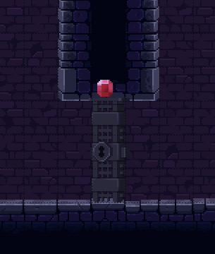


## Fans

Fans work just like fans from the real world, however they are _slightly_ stronger than in the real world. So, depending on where they are pointing to, they can make Adam fly or serve as an impassable obstacle.

This mechanism uses a mix of layers and objects. While the fans inside the tile layer called `fans` determine the direction of the air flow, rectangles in the object layer `fans` determine the active area of the fans. The idea is that all fans within one rectangle work together as one unit. So when defining the rectangles make sure they nicely overlap with the fan tiles. You can achieve that by using the `ALT`-key inside Tiled.

Apart from the `z` depth, fans have a 'speed' value:

|Custom Property|Type|Description|
|-|-|-|
|speed|float|The speed value typically ranges from [`0..1`], `0.9` turned out to be a suitable value.|

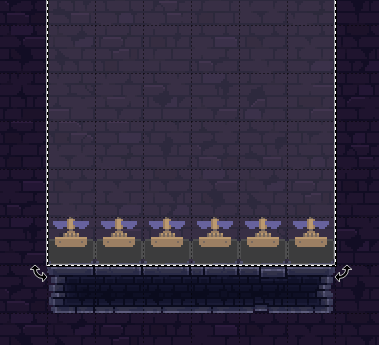


## Lasers

Lasers follow the same concept as fans and are based on a combination of tiles and objects. Since the tileset allows rather complex laser shapes including mirror tiles, the object layer is used so you can group your laser tiles to one coherent 'unit'.

So the first thing you do is to place all your laser tiles inside a tile layer called `lasers_2` and then create an object layer `lasers_2` where you draw a rectangle that covers all the laser tiles that belong together (`_2` because we want to use the 2nd version of the laser implementation).

Apart from the `z` depth, lasers have the custom properties below:

|Custom Property|Type|Description|
|-|-|-|
|off_time|int|The duration the laser is in 'off' state (in ms)|
|on_time|int|The duration the laser is sin 'on' state (in ms)|

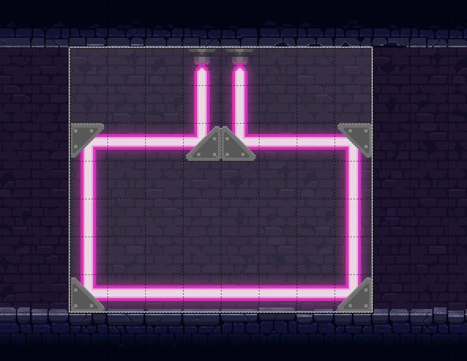

<br><br>


## Bubble Cubes

Bubble Cubes serve as a solid platform the player can land on and jump off again. However, once the player contact to the Bubble Cube ends, it pops and only respawns after a couple of seconds.

In order to place Bubble Cubes in your level, create an object layer called `bubble_cubes`. In there, just place a rectangle where you'd like to position your Bubble Cube.
Their dimensions (including margin) is 3 x 2 tiles so it makes sense to adjust your rectangle accordingly.

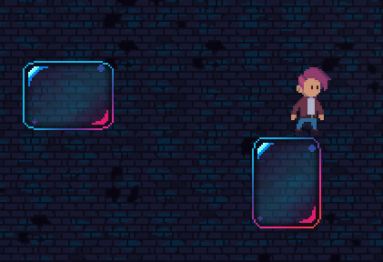

|Custom Property|Type|Description|
|-|-|-|
|animation_offset_s|float|An offset for the bubble animation (in seconds), so they're not in sync. The default value is `0s`.|
|pop_time_respawn_s|float|The time elapsed until the bubble respawns (the default is `3s`)|

<br><br>

## Portals

Portals can teleport Adam from one location to another. For that reason, they give you a lot of freedom in your level design possibilities since you can have a coherent level, even though your individual rooms are distributed all over the map.

When the player enters a portal, a transition animation - like a fade-out/fade-in - is played so the viewer has no idea of what is happening behind the curtains.

In order to create portals, first create a tile layer called `portals` where you place your portal tiles. Then, in an object layer, also called `portals`, you draw a polyline from the center of one portal to another. Now they are linked and the player can go back and forth between them. The first position of the polyline is the entrace, the 2nd position is the exit. Therefore, an exit also be an entrace to another portal. If you only draw a single polyline between two portals, it's just a simple two-way mechanism.

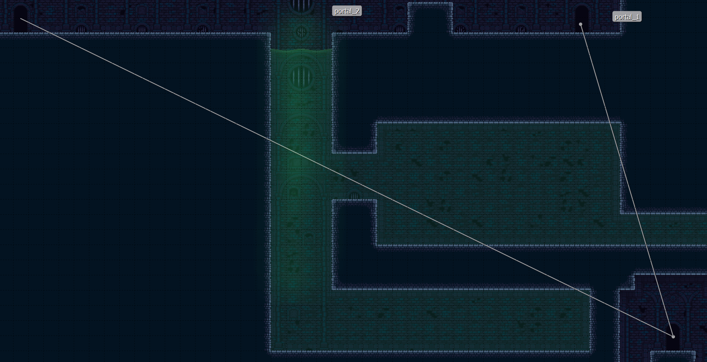

In the screenshot above, Adam enters at the top left, exits at the bottom right, and when he enters again, teleports to the top right.

<br><br>

## Crushers

As the name promises, Crushers can crush Adam. They consist of a bunch of spikes connected to a heavy weight that moves to one direction with high velocity and then retracts again.

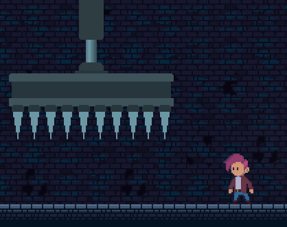

Crushers can be added to your level by adding an object layer called `crushers`. To change the Crushers' alignment, please refer to the Custom Properties below:

|Custom Property|Type|Description|
|-|-|-|
|alignment|string|Direction of the Crusher (valid values are '`up`', '`down`', '`left`', '`right`')|

<br><br>


## Death Blocks

Death Blocks are spiky boxes that move back and forth along a given line. Depending on your tilesheet the direction of the Death Block's rails is either horizontal, vertical, but can actually be any arbitrary angle.

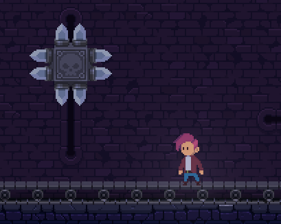

Since you draw the 'rails' of the Death Blocks just to a background layer, this mechanism only requires a polyline object added to the object group `death_blocks`

<br><br>


## Levers

Levers! One of the most important mechanisms. In short, they do what levers do: They switch things on and off. Levers can be used to enable and disable the functionality of these mechanisms:
- Conveyor Belts
- Fans
- Lasers
- Platforms
- Spikes

While you draw your levers just into a tile layer called `levers`, a connection between another mechanism and the lever is created by adding an object group `switchable_objects`; in there you draw a rectangle that covers both the object(s) that should be switched on and off as well as the lever.

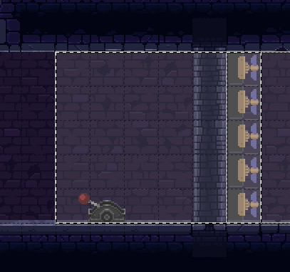

In the screenshot above the fans will go off once the lever is activated.

|Custom Property|Type|Description|
|-|-|-|
|enabled|bool|Defines the initial state of the lever which is either enabled or disabled|

<br><br>


## Ropes

The Deceptus Engine is able to connect other objects to ropes attached to mounts. So far this is only used for visual effects, later on - if there is any demand - the Engine can be extended to allow the player to hold on to the rope or attach other objects to it.

Moreover, ropes have a number of properties to simulate 'wind behavior'. So you can also place them next to open windows out outside areas.

So far you can create ropes in your level by creating an object group called `ropes`.

|Custom Property|Type|Description|
|-|-|-|
|push_interval_s|float|The interval how often the rope is pushed (in seconds, a good value is `5.0`)|
|push_duration_s|float|The duration for how long the rope is pushed (in seconds), a good value is `1.0`|
|push_strength|float|The amount of force to be applied for each frame during the push duration (`0.01` is a good value)|
|segments|int|The amount of segments your rope should have (less is better, `7` is a good value)|

Read more about Ropes in the paragraph 'Ropes with Lights'.

<br><br>


## Spike Balls

Spike Balls are nasty. They're heavy balls with spikes connected to a chain which move from left to right and back. Adam can either duck or jump to make his way past them, however it requires a little practice to master them.

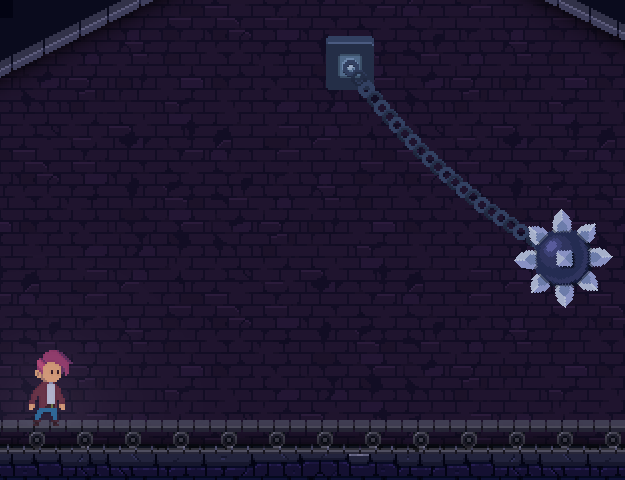

In order to add Spike Balls to your level, you have to create an object layer called `spike_balls`. In there, you place a rectangle at the location where the Spike Ball's chain shall be mounted.

It is very important to place that mount high enough, otherwise the ball will crash into the physics representation of your level and the physics engine will go a bit crazy.

<br><br>

## Spikes

Sharp spikes moving out of the ground are making Adam's life even harder. There are three types of spikes:
- Interval Spikes: They extend and retract in 2 second intervals.
- Trap Spikes: They extend upon contact after 250ms.
- Toggle Spikes: Those are enabled or disabled using a lever.

In order to create any of the spike types above, create a tile layer named `toggle_spikes`, `trap_spikes`, or `interval_spikes`. Then draw your spike tiles into any of these layers as needed.

If you do not know how levers work, you can read more about that in the description of the 'Lever' mechanism.

As a side-note. If you want spikes that are extended, just put them into your `toggle_spikes` layer and don't create a connection to any lever.


<br><br>


## Moving Platform

Moving Platforms are platforms that follow a certain path inside your level. They can be used just like an elevator or for any other purpose, like moving over a couple of deadly spikes, etc.

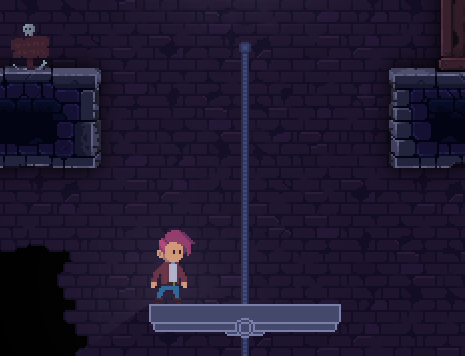

To create moving platforms, the first thing to do is to draw your platform rail tiles into any background tile layer so know which path the platform is supposed to follow. This is only an optical change to your level since the actual path your platform will follow is defined in an object group called `platforms`. Therefore the next step is to create this object group and to draw a polyline from start to end. The last thing to do is to create the actual platform. That's done by simply placing a rectangle into the same layer which overlaps the path you defined in the previous step. The width should be a multiple of `24px` and the height should be `12px`.

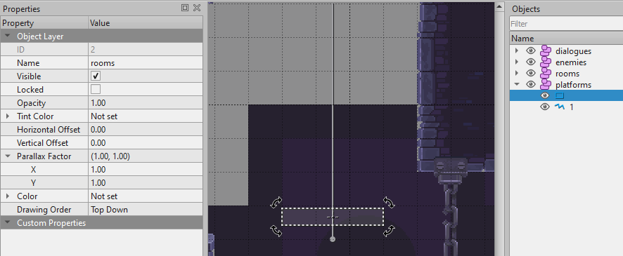


<br><br>

## One-Way Walls

When making the decision to build a platform game engine on top of a realistic physics system such as Box2D, the need to have one-way walls is - from the software developer perspective - the greatest imaginable pain in the ass. Anyway, they're implemented. You are welcome.

If you ever played any Mario title in your life, you will know what a one-way wall is. The concept is very simple: The player jumps up, the player passes through the wall. The player starts falling down again, the wall becomes solid.

Like the `level` tile layer, there's also a layer for tiles with one-way behavior. It is called `level_solid_onesided`. When designing the shape of these tiles in Tiled's 'Tile Collision Editor', they should be defined as boxes with a height of 1px and a width of 24px:

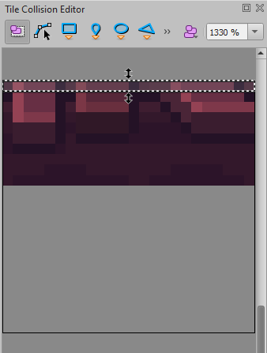

So once all the tile shapes are set up, they can be drawn into the tile layer. When that's done, it is possible to debug the generated physics shapes in the game by pressing `F1`.

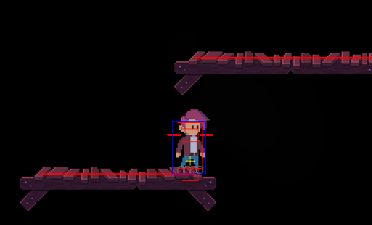

While the player moves through the one-way walls by pressing the jump key / button, it is possible to drop from a one-way wall by pressing jump together with the down key / button.


<br><br>

## Moveable Objects

At the moment this object type should rather be called 'Moveable Box' since their (rectangular) shape and texture is hardcoded. However, that might change in the future.

Anyhow, Moveable Objects are objects the player can push from one position to another just by walking against it. This way Adam might be able to climb obstacles, block enemies, etc.

The way to create a moveable object, create a rectangle object inside the object group `moveable_objects`. So far the sprite set supports 24x24px and 48x48px boxes. Depending on the size of your rectangle object, the right texture is selected.

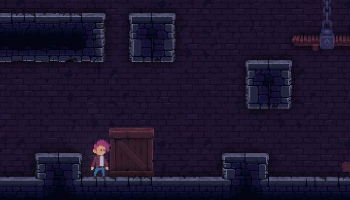


<br><br>


## Extras

Extras are currently hardcoded, i.e. the ID of each extra in the extra tileset is mapped to one particular extra inside the C++ code. Whenever Adam 'collides' with an extra tile, the Engine's `ExtraManager` is invoked. This is where you'd have to adjust the engine as needed.

```cpp
  case ExtraItem::ExtraSpriteIndex::Banana: // this is your tile id
    SaveState::getPlayerInfo().mExtraTable.mHealth.addHealth(10);
    break;
```

Apart from that, placing extras in your level is easy. Just create a tile layer called `extras` where you place your extra tiles.

<br><br>

## Dialogues

The Deceptus Engine can display message boxes which are shown when the player is inside a defined area and presses a button to activate the message box.
This is usually the `up` button of your keyboard or dpad.

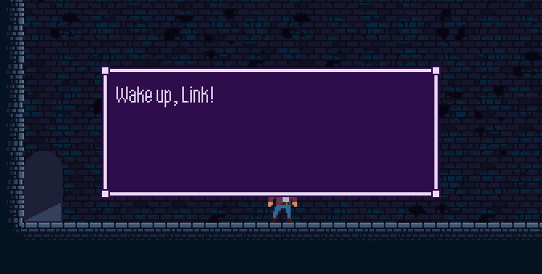

The message boxes can vary in color and can contain multiple messages.
In the future they might be extended so they can alter in location, color and animation.

In order to introduce a message box, you create an object layer 'dialogues' where you define a rectangle that defines the area where a message box is shown when activated.

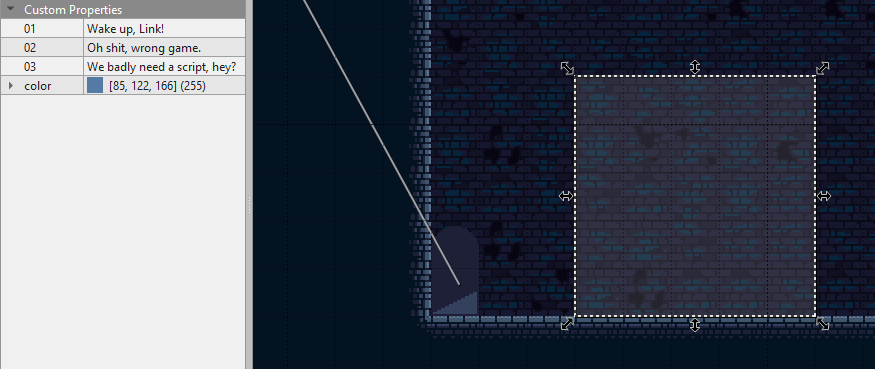

Each message box has the custom properties below:

|Custom Property|Type|Description|
|-|-|-|
|01|string|The first message to show|
|02|string|The second message to show|
|03|string|The third message to show|
|nn|string|The nth message to show, you get the idea...|
|color|color|The color of the message box|


<br><br>

## Controller Help

When you're designing tutorial levels that should introduce the user to the basic game controls, it makes sense to visualize those controls inside the level.
E.g. when the player has to press a certain button to open a door etc. the related button could be indicated.

You do so by creating a layer called `controller_help` and inserting rectangles in there for those areas where help should be shown.

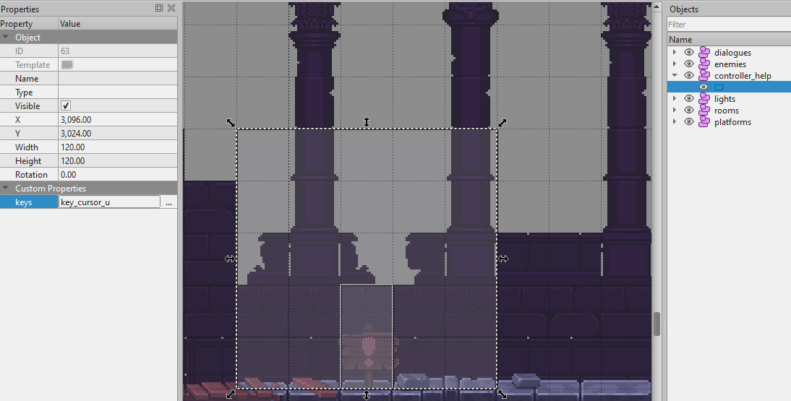


|Custom Property|Type|Description|
|-|-|-|
|keys|string|A semicolon delimited string that lists the key/button combinations to be shown|

### Available Keys

||0|1|2|3|4|5|6|7|8|9|10|11|12|13|14|15|
|-|-|-|-|-|-|-|-|-|-|-|-|-|-|-|-|-|
|0|`key_esc`|`key_1`|`key_2`|`key_3`|`key_4`|`key_5`|`key_6`|`key_7`|`key_8`|`key_9`|`key_minus`|`key_equals`|`key_backspace`||||`
|1|`key_tab`|`key_q`|`key_w`|`key_e`|`key_r`|`key_t`|`key_y`|`key_u`|`key_i`|`key_o`|`key_p`|`key_bracket_l`|`key_bracket_r`||||`
|2|`key_caps`|`key_a`|`key_s`|`key_d`|`key_f`|`key_g`|`key_h`|`key_j`|`key_k`|`key_l`|`key_semicolon`|`key_apostrophe`|`key_return`||||`
|3|`key_shift`|`key_0`|`key_z`|`key_x`|`key_c`|`key_v`|`key_b`|`key_n`|`key_m`|`key_comma`|`key_period`|`key_question`|`key_backslash`||||`
|4|`key_ctrl`|`key_win`|`key_alt`|`key_empty`|`key_list`|||||`key_cursor_l`|`key_cursor_u`|`key_cursor_d`|`key_cursor_r`||||`
|5|`bt_a`|`bt_b`|`bt_x`|`bt_y`|`bt_list`|`bt_menu`|`bt_rt`|`bt_lt`|`bt_lb`|`bt_rb`|||||||`
|6|`dpad_u`|`dpad_d`|`dpad_l`|`dpad_r`|`bt_u`|`bt_d`|`bt_l`|`bt_r`|`bt_1`|`bt_2`|`bt_3`|`bt_4`|`bt_5`|`bt_6`|`bt_7`|`bt_8`|`
|7|`bt_r_u`|`bt_r_d`|`bt_r_l`|`bt_r_r`|`bt_r_u_d`|`bt_r_l_r`|`dpad_empty`|`bt_0`|`bt_9`|`bt_10`|`bt_11`|`bt_12`|`bt_13`|`bt_14`|`bt_15`|`bt_16`|`
|8|`bt_l_u`|`bt_l_d`|`bt_l_l`|`bt_l_r`|`bt_l_u_d`|`bt_l_l_r`|||||||||||`

Depending on whether a keyboard or a game controller is connected, the buttons below will be mapped as follows:

|Key|Button|
|-|-|
|`key_cursor_u`|`dpad_u`|
|`key_cursor_d`|`dpad_d`|
|`key_cursor_l`|`dpad_l`|
|`key_cursor_r`|`dpad_r`|
|`key_return`|`bt_a`|
|`key_escape`|`bt_b`|


<br><br><br>

# Enemies

With the aim to give non-C++ programmers the ability to develop or adjust the behavior of enemies, all enemies were implemented in `lua`. Inside the folder `data/scripts/enemies` you will find a number of scripts you can use as a reference to implement your own enemies or alter their behavior as needed.

The Deceptus Engine offers two ways to integrate enemies inside your level.

## Adding Enemies

In the early days of the Deceptus Engine enemies were added just by defining a huge list of references to the enemy lua scripts bundled together with a couple of properties such as their start positions or the path they move along.

You can configure enemies by editing the json by hand, or - depending on your liking - directly position enemies inside Tiled.

### Adding Enemies with level.json

The first thing to do is to have a json array `enemies` inside your json file.
```json
  "enemies": [

  ]
```

Next, you have to have one section for each enemy instance inside this array. For this purpose you would usually define the '`script`' as well as '`startposition`' of your enemy. The start position is entered in tile coordinates.
```json
    {
      "script": "ghost.lua",
      "startposition": [233, 82],
      "path": [238, 82]
    },
    {
      "script": "bonefish.lua",
      "startposition": [250, 99],
      "path": [250, 99, 256, 99]
    },
```

All properties that are applicable for each enemy type are listed below.

<br>

### Adding Enemies with Tiled

The Tiled approach follows the same concept with the only difference that properties required to configure an enemy are entered through Tiled's Custom Properties. Of course the start position does no longer need to be entered manually since you will just position your enemy inside Tiled.

In order to insert an enemy in your level using the Tiled editor, create an object group called '`enemies`' and insert a rectangle at that location where your enemy should be positioned. Then define all enemy properties inside the Custom Properties, such as


|Custom Property|Type|Description|
|-|-|-|
|script|string|Name of the enemy's lua script|
|path|string|A comma separated list of positions in tile coordinates (x0, y0, x1, y1, etc.)


<br>

### Adding Enemies with Tiled and level.json

In order to make things a bit more confusing, there's even a third way to place enemies inside your level. And the choice is really up to you, there's no 'wrong' way to do it. In this method, you just place a rectangle object inside your `enemies` object group and remember its _Object ID_.


Then, you open up the `level.json` description and add a reference to that object. Now, just add further enemy-related properties to the json as described in the first paragraph of this chapter.

```json
    {
      "script": "critter.lua",
      "id": "260",
      "generate_path" : true
    },
```

Below you will find a description of all enemies including a table of their properties.

<br><br>

## Enemy Design and Properties

### Arrow Trap


Arrow Traps shoot arrows in a particular direction.

|Property|Type|Description|
|-|-|-|
|script|string|`arrowtrap.lua`|
|alignment|string|Arrow direction: '`up`', '`down`', '`left`', '`right`'|

<br>

### Bat


A bat usually sleeps somewhere at the ceiling of a room. When woken up by Adam, it attacks.

|Property|Type|Description|
|-|-|-|
|script|string|`bat_2.lua`|
|script|string|Name of the enemy's lua script|

<br>

### Blob


A Blob can either move left and right on the floor or ceiling of a room, jump up and down and actually even jump down and up.

|Property|Type|Description|
|-|-|-|
|script|string|`blob_2.lua`|
|jump_height_px|string|If the Blob should jump, define its jump height in `px`|
|gravity_scale|float|If the Blob should walk the ceiling instead of the floor, you can set its gravity scale to `-1.0`. It'll go positive once the Blob is right over Adam. Then it'll fall down.|
|jump_interval_ms|int|If the Blob should jump, you have to define its jump interval (in `ms`).|
|path|string|Usually you would only define a 2nd x,y-position here which will make the Blob go back and forth between its start position and the other position. You can also enter more than one position if needed. Format: `x0, y0, x1, y1, etc.`|

<br>

### Bonefish


|Property|Type|Description|
|-|-|-|
|script|string|`bonefish.lua`|
|path|string|Usually you would only define a 2nd x,y-position here which will make the Bonefish go back and forth between its start position and the other position. Format: `x0, y0, x1, y1, etc.`|

<br>

### Cannon


Well... it's a cannon. It fires... cannon balls.

|Property|Type|Description|
|-|-|-|
|script|string|`cannon_2.lua`|
|alignment|string|Cannons either point to the '`left`' or to the '`right`'.|


<br>

### Critter


Small spiky enemy that can crawl up walls and simply goes its way round and round and round without ever getting tired.

|Property|Type|Description|
|-|-|-|
|script|string|`critter.lua`|
|generate_path|bool|If `true`, the Deceptus Engine will automatically trace the edge the Critter has been placed on and turn it into a path. Then the Critter will follow this path. This only works for closed loops.|

<br>


### Ghost


Ghosts fly around following a given path. When Adam gets close by, they try to scare him away.

|Property|Type|Description|
|-|-|-|
|script|string|`critter.lua`|
|path|string|The ghosts path given as a list of x,y-positions; format: `x0, y0, x1, y1, etc.`|

<br>

### Klonk


A heavy solid piece of stone that gets angry when Adam is underneath and tries to squash him.

|Property|Type|Description|
|-|-|-|
|script|string|`klonk_2.lua`|


<br>

### Landmine


Ugly piece of technology. When Adam steps onto one of these, it's time to run real quick.

|Property|Type|Description|
|-|-|-|
|script|string|`landmine.lua`|

<br>


### Watermine


Another ugly piece of technology. Same concept as landmine but underwater.

|Property|Type|Description|
|-|-|-|
|script|string|`watermine.lua`|


<br><br><br>

# Visualization


## Adding Parallax Layers

In order to create the illusion of depth, some time in the 90s Parallax layers were introduced. Those are basically layers in the background that scroll at a different pace than the foreground.

Deceptus supports 3 Parallax layers.<br>
All Parallax layer names must start with `parallax_`.

They have the properties below:
|Custom Property|Type|Description|
|-|-|-|
|factor_x|float|The horizontal scrolling pace in relation to the foreground [`0..1`]|
|factor_y|float|The vertical scrolling pace in relation to the foreground [`0..1`]|
|offset_x|int|Imagine the contents of your tile layer are located somewhere in the middle of your level. In that case the parallax factor would be applied and your contents would not end up at that location where you placed them in Tiled but shifted much further to the top/left. That's because every tile position is multiplied with the parallax factor. To compensate that, you can define an offset (given in pixels) to where your actual contents begin, e.g. at `2640, 2880`. The same goes for the vertical error (offset_y).|
|offset_y|int|Please see `offset_x`|
|slot|int|The reference to the Parallax layer slot. Since Deceptus supports 3 slots, the value range goes from [`0..2`]|
|z|int|As you might want to place something _behind_ your parallax layers, configuring the z index might be useful, too. The default value is `0`.|


<br><br>

## Adding Image Layers

If you want to insert images into your level without being restricted to the 24x24px tile size, you can use Image Layers. In order to do so, you can just create a new 'Image Layer' inside Tiled.

Deceptus supports different blend modes for Image Layers.

They have the properties below:
|Custom Property|Type|Description|
|-|-|-|
|blendmode|string|Valid blend modes are: '`alpha`', '`multiply`', '`add`', '`none`'|

<br><br>

## Static lights

Static lights are probably the simplest 'visual effect' inside the Deceptus Engine. They are basically additive sprites, i.e. the sprites' color information is added on top of the color of your level.

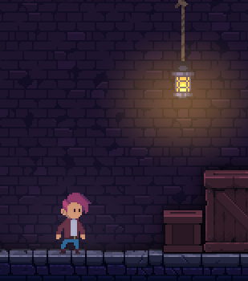

Static lights are added by introducing a new object group starting with `static_lights`.

The individual lights are created as rectangle objects with the parameters below:

|Custom Property|Type|Description|
|-|-|-|
|color|color|Color of the light (optional, the default is white)|
|flicker_intensity|float|If the light should flicker a bit, this controls the flicker intensity (optional, from `0..1`, a good value is `0.5`)|
|flicker_alpha_amount|float|The opacity of your light source (optional, from `0..1`, a good value is `0.7`)|
|flicker_speed|float|How fast to step through the flicker noise function (optional, from `0..100`, a good value is `5`|

<br><br>

## Dynamic Lights

In order to make the games atmosphere more lively, the Deceptus Engine comes with a shader (a program run on your GPU) that implements light sources that cast shadows and illuminate your objects. The latter uses bump maps. Those are texture that describe how your objects reflect light. Shadows are cast based on the collision information that you define in your `level` layer.

The screenshot below shows a dynamic light creating reflection on the wall's bump map and casting shadows:<br>
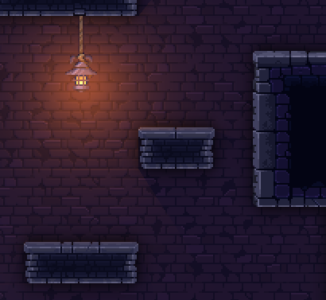


In order to create a dynamic light source, have an object layer called `lights` inside your level. Into that layer you add rectangle objects. The width and height of that rectangle define the maximum range of your light. However, your actual light behavior is controlled by the custom properties below. They are based on the concept of 'Constant-Linear-Quadratic Falloff'. Yup, you can google that.

|Custom Property|Type|Description|
|-|-|-|
|color|color|The color of your light source (default is white)|
|falloff_constant|float|The amount of illumination that is independent of the distance to the light source (range `0..1`). The name is a bit misleading. There's no falloff at all. The function is simply `attenuation = 1 / falloff_constant`. A good value is `0.4`. <br><br>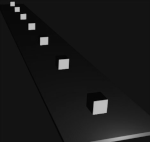|
|falloff_linear|float|The further away from the light, the darker it gets. `falloff_linear` is a factor for the distance (`attenuation = 1 / (falloff_linear * distance_to_light)`). A good value is `3`.<br><br>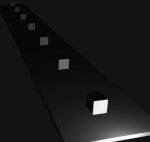|
|falloff_quadratic|float|The further away from the light, the less illumination - but this time the distance is squared (`attenuation = 1 / (falloff_quadratic * distance_to_light^2)`). A good value is `20`.<br><br>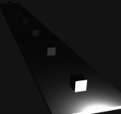|
|center_offset_x_px|int|You may adjust the center of your light source using this x-offset (optional)|
|center_offset_y_px|int|You may adjust the center of your light source using this y-offset (optional)|
|texture|string|You can use a texture to give your light source a specific look (optional), <br>Some examples:<br><br>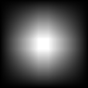 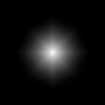 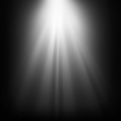|


<br><br>

## Playing with Dynamic Lights / Ropes with Lights

Since bump maps are a lot more convincing when light is in motion, the 'Ropes with Lights' mechanism has been implemented. It is not listed under the mechanisms as it does not have any impact on the gameplay; it is just a cosmetic addition.

Ropes with Lights are exactly what the name promises. They are based on the Rope mechanism while the light source is attached to a rope. In order to place them inside your level, create an object group called `ropes_with_light` and place a rectangle object in there.

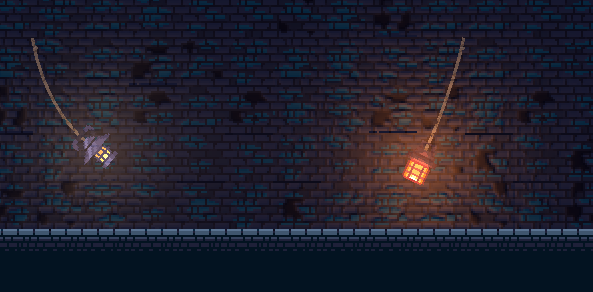

So on top of the Rope properties, there are a few additional ones:

|Custom Property|Type|Description|
|-|-|-|
|push_interval_s|float|The interval how often the rope is pushed (in seconds, a good value is `5.0`)|
|push_duration_s|float|The duration for how long the rope is pushed (in seconds), a good value is `1.0`|
|push_strength|float|The amount of force to be applied for each frame during the push duration (`0.01` is a good value)|
|segments|int|The amount of segments your rope should have (less is better, `7` is a good value)|
|_color_|color|The color of the dynamic light (the default is white)|
|_sprite_|int|At the moment the mechanism just supports two different light types, so it's either just `1` or `2`|

<br><br>

## Atmosphere layers

At the moment the Deceptus Engine supports two different types of atmosphere:
- Air
- Water

If you would like to create an underwater area inside your level, you have to create a new tile layer called `atmosphere`. Now add the file `physics_tiles.tsx` to your level as well as `collision_tiles.png` to your tilesets directory. Then paint areas with water physics using the blue quad. The surface of your water should have the blue gradient.

Once you're done, hide the layer so it's not shown when you run the game.

All layers underneath the level z depth will then be drawn with a little distortion to simulate the refraction of the water.

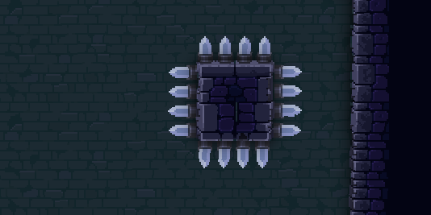


<br><br>

## Shader Quads

Shader Quads are rectangle objects you can place inside your level that will render the output of a shader inside the rectangle's canvas. So far vertex shaders and fragment shaders are supported. Vertex shaders work on a per-vertex basis while fragment shaders are executed for each pixel. In most cases you will probably just want to configure a fragment shader.

To create a Shader Quad, create an object group starting with `shader_quads`. Then define a rectangle object with the custom properties below:

|Custom Property|Type|Description|
|-|-|-|
|z|int|The z depth of your object layer (as always)|
|vertex_shader|string|the relative path to your vertex shader (optional)|
|fragment_shader|string|the relative path to your fragment shader (optional)|
|texture|string|a path to a texture used by the shader|

Here's an example of a fragment shader implementing a waterfall:

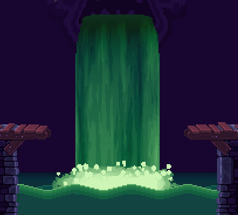

<br><br>

## Weather

While this document is written, the Deceptus Engine supports only a the weather types 'rain' and 'thunderstorm'. Great. So if you are planning to have any outdoorsy part in your level or a view outside the window that's supposed to have real shitty weather, then create an object group `weather`.

### Rain
To define a rainy region, set up a rectangle inside your `weather` object layer. The rectangle's name is supposed to start with `rain`.

Rain layers have the custom properties below:

|Custom Property|Type|Description|
|-|-|-|
|z|int|The z depth of your rain layer|
|collide|bool|Set to true if rain drops should collide with the Box2D world; otherwise they will just fall through|
|drop_count|int|Number of rain drops used inside this layer|
|fall_through_rate|int|Decides how many nth rain drops are passed through to the collision detection. Set to `0` or `1` to make every rain drop colliding, set to `2` to pass every second drop to the collision detection, and so on. This setting is only relevant when `collide` is set to `true`.|


<br><br>

### Thunderstorm
Usually you want to have your thunderstorm effect in the very back of your layer stack or somewhere in between your parallax layers.
Thunderstorm layers are basically big quads that change their color to white for a short time based on a randomized function.
They work well in combination with rain and will make your scene lively and atmospheric.

To create a thunderstorm region, just create a rectangle starting with the name `thunderstorm` inside your `weather` layer.
Thunderstorms have the custom properties below:

|Custom Property|Type|Description|
|-|-|-|
|z|int|The z depth of your thunderstorm layer|
|thunderstorm_time_s|float|The duration of the lightning phase. The default is `3s`.|
|silence_time_s|float|The duration for everything to be 'quiet', i.e. from one lightning phase to the other (given in seconds). The default is `5s`.|

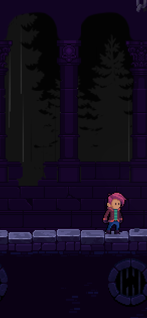 &nbsp;&nbsp; 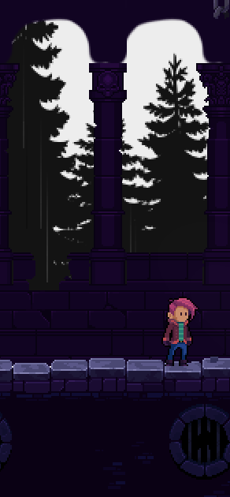

<br><br>


## Smoke (experimental)

Smoke has been added to the Engine to be able to create foggy/smokey atmosphere that looks a little creepy. Even though it is not too configurable yet, it might be a good additional to your level wherever you think it is suitable. Smoke is added by creating an object group called `smoke` and adding a rectangle in there that is as big as the area that should be filled with large smoke sprites.

So far that is all there is to know.
A couple of custom properties such as thickness, texture and color are promised for the future.

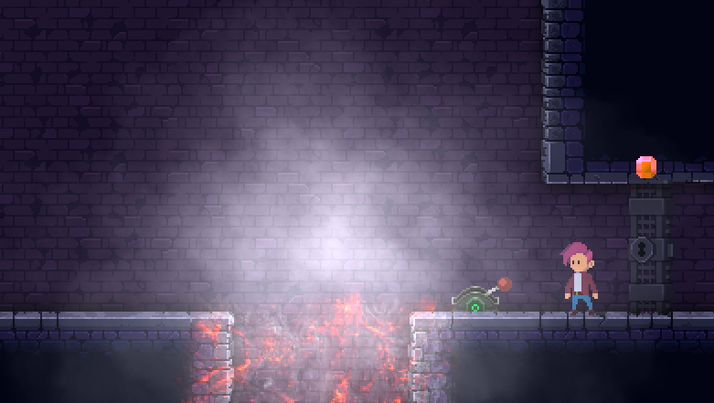

<br><br>


## Ambient Occlusion

When you are _done_ with your level design and already went into the polishing phase, it might be the right time to add Ambient Occlusion (AO). Those are pre-baked shadow textures that will be rendered onto your level tiles and will make your level look a lot less sterile.

The workflow how to create Ambient Occlusion tiles is not fully automated but also not too complicated to do by hand. Since you're not doing this every day, it's probably appropriate to run those 3 tools below to generate your AO.

When you look at the different between a level without and with AO, I hope you agree that it's worth the effort.

Level without AO enabled
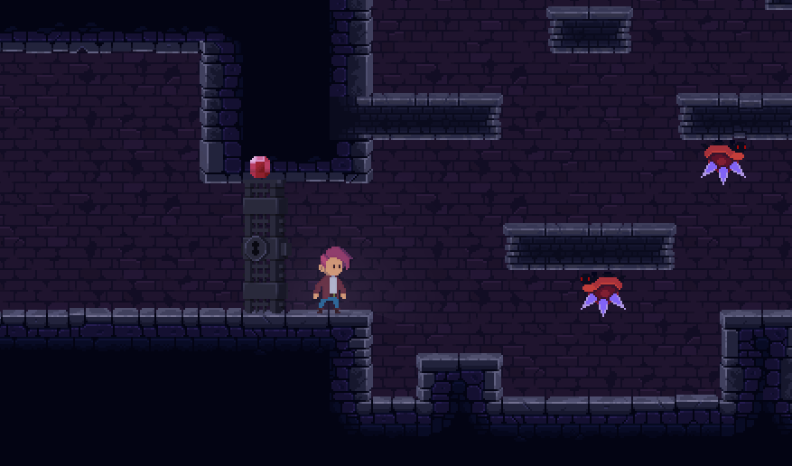

Level with AO enabled
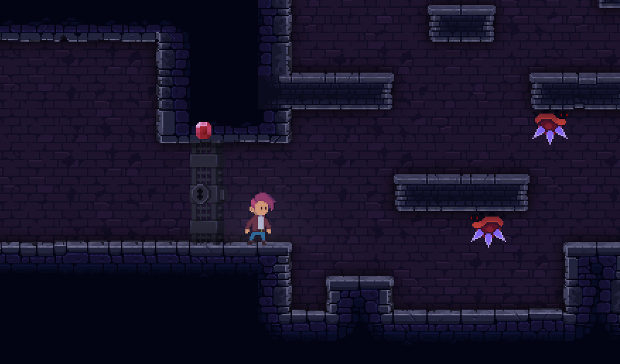

### First step: Convert your level layer into an image

Since the AO shadows are based on your level's `level` layer, we'll use a modified version of Tiled's TMX Rasterizer which is stored inside `tools/tmx_rasterizer`. In order to generate a `png` out, we'll just point the tool to your tmx file and hide all layers but `level`:

```bash
c:\git\build\tools\tmx_rasterizer>tmxrasterizer.exe --show-layer "level" ..\..\data\level-malte\malte.tmx level.png
```

### Second step: Generate a shadow texture out of the level texture

The Deceptus Engine comes with a tool called 'Generate AO' which will basically turn all color information in your level layer black, then blur it and make it rather transparent so the shadows won't be too intense.

The tool is stored inside `tools/generate_ao` and is just pointed to the `png` file you generated in the first step:

```bash
C:\git\build\tools\generate_ao>generate_ao.exe level.png
[x] processing texture: level.png
[x] loading original texture
[x] creating black/transparent texture
[x] blurring black/transparent texture
[x] cutting out original contents...
[x] writing texture to disk
[x] written ao texture to: level_ao.png
```

### Third step: Turn the large AO texture into tiles

Your GPU would probably implode if we loaded a texture into it that has the texture size of your level, so we're gonna turn it into tiles.

The tool inside the Deceptus Engine that's designed for this purpose is called 'Pack Texture' and it's stored inside `tools/pack_texture`.

It's a simple UI tool that will load a very large texture, turn that into a grid and save every cell that is not entirely empty to a 'packed texture'. The output of this tool is therefore a new texture plus a 'UV file' which will tell the Deceptus Engine where each cell shall be drawn.

Anyway, you should select a 'good' grid size (32x32 is good in most cases) that will allow packing to a texture that is as small as possible. You can play around with the options and select 'File', 'Pack' until you generate a texture that is equal or smaller than 4096 x 4096px. It really shouldn't be larger than that.

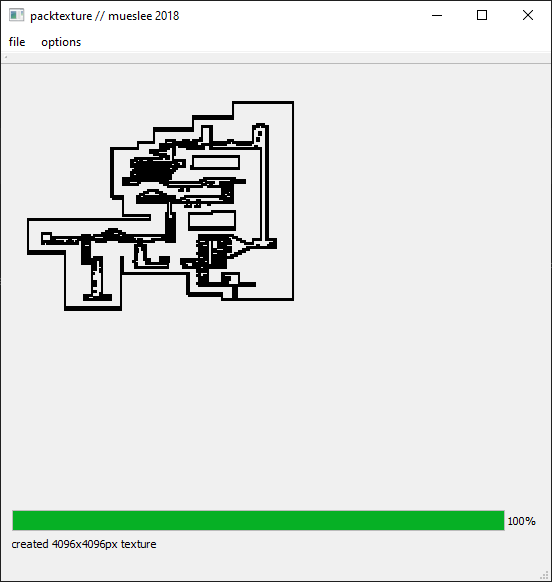


### Last step: Copy AO tiles and UV map to your level

The last step is just to copy the `<level_name>_ao_tiles.png` and `<level_name>_ao_tiles.uv` to your level directory.


### Gosh, I wanna automate all this!

Okay, okay, okay - here you go.
Place the script below inside your level directory and run it from there.

`generate_ao.bat`
```bash
..\..\tools\tmx_rasterizer\tmxrasterizer.exe --show-layer level my_level.tmx my_level.png
..\..\tools\generate_ao\generate_ao.exe my_level.png
..\..\tools\pack_texture\packtexture.exe --input=my_level_ao.png --size=64
```


<br><br><br>


# Advanced Topics

## Checkpoints

Whenever Adam reaches a checkpoint, the current state of the game is saved. I.e. the player's current skills (such as double jump, wall slide, wall jump etc.) and the player's location within the level are serialized to disk. When the player dies later on, he would re-spawn at the last checkpoint.

Checkpoints are implemented as simple rectangle objects inside your level. In order to add checkpoints to your level, define an object group '`checkpoints`' and add rectangles inside this group that have reasonable names. The last checkpoint, i.e. the end of your level, must have the name '`end`'.

Checkpoints have the custom properties below:

|Custom Property|Type|Description|
|-|-|-|
|index|int|The index of your checkpoint. The player will always respawn at the last reached checkpoint with the largest index.|
|sprite_pos_x_px|int|x position of the checkpoint sprite (given in px)|
|sprite_pos_y_px|int|y position of the checkpoint sprite (given in px)|
|z|int|The z index of the sprite layer|


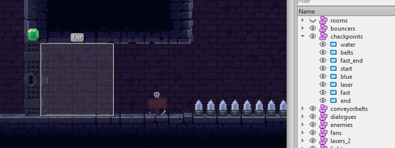


<br>

## Rooms

Usually the game's camera system keeps on following Adam so he always stays in focus. However, in Metroid-like games it's quite common to limit the camera range to one room, open a door, go to the next room and then move the camera's focus over to the other room.

If you are using rooms, it is important to make them at least as large as your screen (640x360px). Having rooms smaller than one screen would defeat the point of having rooms, hey?

If you define 2 rooms, the camera would limit the viewer's perspective to that room until the player has left that room. Then the camera would either move over to the next room or just focussing Adam if he entered a region where no room is defined.

Rooms are rectangles, or combinations of rectangles. In order to define a room, create an object group '`rooms`' first, then draw rectangles around those area that are supposed to be your rooms. Rooms should be given descriptive labels such as '`kitchen`' or '`bathroom`'. If you want to merge multiple rects together to one larger room, you can also do that. Just append '`_0`', '`_1`' etc. to your room labels such as '`bedroom_0`', '`bedroom_1`' even though no sane person would ever voluntarily merge their bedrooms.

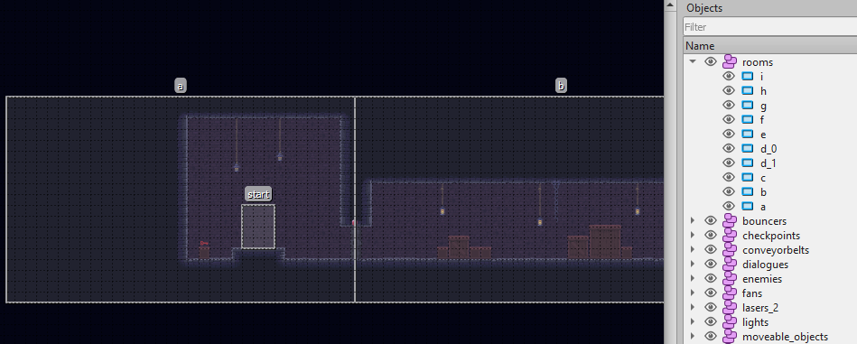

There can be screen transitions between rooms. For example, you may define a 'fade transition' for a room. That will fade the camera out, when the player just entered the room and the camera still focusses the 'old' room and then fade it when the new room is in focus. There are quite a few settings to give the user all liberty to set this up right. Once you've come up with a good set of settings, it makes sense to keep them consistent across all rooms.

|Custom Property|Type|Description|
|-|-|-|
|transition|string|The type of the transition. At the moment only the type `fade_out_fade_in` is supported (optional).|
|fade_out_speed|float|An factor used to adjust the speed when fading out (optional). `1.0` is slow fading, `2.0` is rather fast. The default is `2.0`.|
|fade_in_speed|float|A factor used to adjust the speed when fading in (optional). `1.0` is slow fading, `2.0` is rather fast. The default is `2.0`.|
|delay_between_effects_ms|int|The delay in ms to be elapsed between both parts (e.g. 'fade out', 'fade in') of the transition (optional). The default value is `250`.|
|camera_sync_after_fade_out|bool|Move the camera focus to the new room immediately after fading out; the new room is then focussed when fading back in (optional). The default value is `true`.|
|camera_lock_delay_ms|int|This value will 'hold' the camera focus in the old room, even though a new room has been entered already. Once the defined time in milliseconds is elapsed, the new room is focussed. The default value is `0`. <br> If `camera_sync_after_fade_out` is set to `true`, it'll override this setting and synchronize the camera position as promised. Actually these two settings work very well together. If you are uncertain what value to put here, you can just choose a rather long duration (1000ms) and enable `camera_sync_after_fade_out`. <br>This will lock the camera in the old room once the player entered a new room. Then, when the screen is black, the camera focus will be moved to the new room (the camera lock is released) and the new room is shown when fading in. It all sounds more complicated than it is. Just try a configuration like this and play around with it:<br>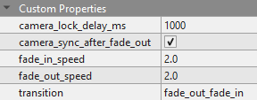|
|start_position_left_x_px|int|When player entering from the left of the room, position him to the absolute x position, given in pixels. Also need to provide `start_position_left_y_px`|
|start_position_left_y_px|int|When player entering from the left of the room, position him to the absolute y position, given in pixels. Also need to provide `start_position_left_x_px`|
|start_position_right_x_px|int|When player entering from the right of the room, position him to the absolute x position, given in pixels. Also need to provide `start_position_right_y_px`|
|start_position_right_y_px|int|When player entering from the right of the room, position him to the absolute y position, given in pixels. Also need to provide `start_position_right_x_px`|
|start_position_top_x_px|int|When player entering from the top of the room, position him to the absolute x position, given in pixels. Also need to provide `start_position_top_y_px`|
|start_position_top_y_px|int|When player entering from the top of the room, position him to the absolute y position, given in pixels. Also need to provide `start_position_top_x_px`|
|start_position_bottom_x_px|int|When player entering from the bottom of the room, position him to the absolute x position, given in pixels. Also need to provide `start_position_bottom_y_px`|
|start_position_bottom_y_px|int|When player entering from the bottom of the room, position him to the absolute y position, given in pixels. Also need to provide `start_position_bottom_x_px`|
|start_offset_left_x_px|int|When player entering from the left of the room, position him to the relative x offset, given in pixels. The y counterpart `start_offset_left_y_px` is optional.|
|start_offset_left_y_px|int|When player entering from the left of the room, position him to the relative x offset, given in pixels. The x counterpart `start_offset_right_x_px` must be provided.|
|start_offset_right_x_px|int|When player entering from the right of the room, position him to the relative x offset, given in pixels. The y counterpart `start_offset_right_y_px` is optional.|
|start_offset_right_y_px|int|When player entering from the right of the room, position him to the relative x offset, given in pixels. The x counterpart `start_offset_right_x_px` must be provided.|

# Addendum

## Folder Structure

Here's an overview of the game's folder structure and some guidance how to set up the file and folder structure of your level.

- `📁 root`
  - `📁 data`
    - `📁 config`: This folder contains all the game's configuration files
    - `📁 effects`: You can store texture custom graphics effects here
    - `📁 fonts`: Truetype and bitmap fonts go here
    - `📁 game`: In-game overlays and menus
    - `📁 joystick`: The SDL game controller database
    - `📁 level-your_level_name`
      - `📄 your_level_name.json`
      - `📄 your_level_name.tmx`
      - 📄 all your `.tsx` files
      - 📄 your ambient occlusion files
      - `📁 images`:  Images for your image layers
      - `📁 tilesets`: Tiles used inside your tmx/tsx files
    - `📁 light`: Your light textures for static and dynamic lights
    - `📁 menus`: All the menu images are stored here.
    - `📁 music`: Well...
    - `📁 scenes`: Image for in-game cut scenes etc.
    - `📁 scripts`
      - `📁 enemies`: All the lua scripts for the game's enemies
    - `📁 shaders`: All shaders used by the Deceptus Engine
    - `📁 sounds`: All sounds used by the engine as well as referened by the lua scripts
    - `📁 sprites`: All enemy sprites, i.e. all sprites that do not depend on a particular level design
    - `📁 weapons`: Weapon-related sprites
  - `📁 doc`
    - `📁 game_physics`: Information about the game physics (such as jump behavior, etc.)
    - `📁 level_design`: This is what you are staring at right now
    - `📁 lua_interface`: A description of the lua interface used by the game's enemies
  - `📁 tools`
    - `📁 generate_ao`: A tool that transforms a colored image into an AO texture
    - `📁 pack_texture`: A program that strips empty areas from textures and creates a new texture plus UVs
    - `📁 path_merge`: A tool that eliminates redundant vertices and generates an optimized coherent mesh
    - `📁 tmx_rasterizer`: A program that extracts layers from a TMX file and generates a single image out of it
