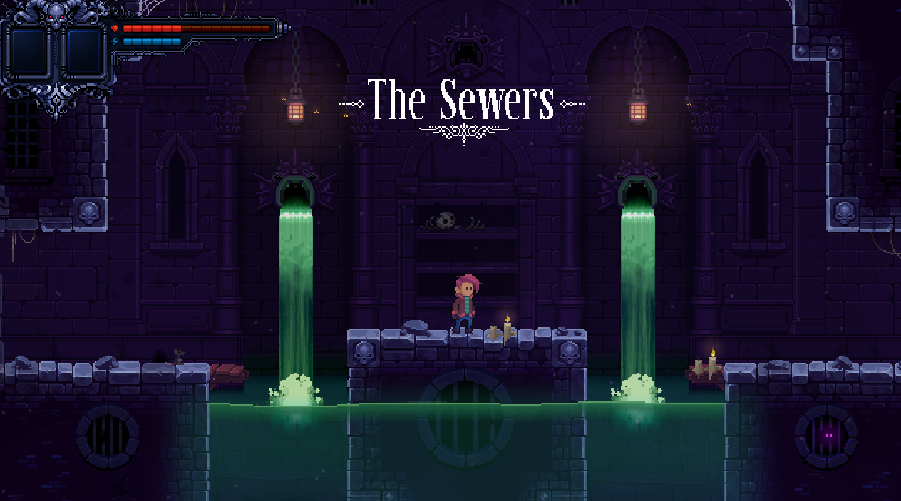

# Visualization

## Tile Map Blend Modes

To configure a blend mode, you can choose from the 3 different blend mode types below.
The easiest and most common approach is to go for pre-defined blend modes.
If the predefined blend modes are not sufficient for you, you can define custom ones. 
There are blend modes that use combined color and alpha channels and those that handle them separately.
The latter give you full configuration freedom.

### Pre-defined Blend Modes
|Custom Property|Type|Description|
|-|-|-|
|blend_mode|string|Predefined blend modes: `add`, `alpha`, `multiply`, `min`, `max`, `none`|

### Blend Mode with Combined Color and Alpha Channels
|Custom Property|Type|Description|
|-|-|-|
|source_factor|Blend Factor (string)|Specifies how to compute the source factor for the color and alpha channels.|
|destination_factor|Blend Factor (string)|Specifies how to compute the destination factor for the color and alpha channels.|
|blend_equation|Blend Equation (string)|Specifies how to combine the source and destination colors and alpha.|

### Blend Mode with Separate Color and Alpha Channels
|Custom Property|Type|Description|
|-|-|-|
|color_source_factor|Blend Factor (string)|Specifies how to compute the source factor for the color channels.|
|color_destination_factor|Blend Factor (string)|Specifies how to compute the destination factor for the color channels.|
|color_blend_equation|Blend Equation (string)|Specifies how to combine the source and destination colors.|
|alpha_source_factor|Blend Factor (string)|Specifies how to compute the source factor.|
|alpha_destination_factor|Blend Factor (string)|Specifies how to compute the destination factor.|
|alpha_blend_equation|Blend Equation (string)|Specifies how to combine the source and destination alphas.|

### Blend Factors
|Custom Property|Description|
|-|-|
|zero|(0, 0, 0, 0)|
|one|(1, 1, 1, 1)|
|src_color|(src.r, src.g, src.b, src.a)|
|one_minus_src_color|(1, 1, 1, 1) - (src.r, src.g, src.b, src.a)|
|dst_color|(dst.r, dst.g, dst.b, dst.a)|
|one_minus_dst_color|(1, 1, 1, 1) - (dst.r, dst.g, dst.b, dst.a)|
|src_alpha|	(src.a, src.a, src.a, src.a)|
|one_minus_src_alpha|(1, 1, 1, 1) - (src.a, src.a, src.a, src.a)|
|dst_alpha|(dst.a, dst.a, dst.a, dst.a)|
|one_minus_dst_alpha|(1, 1, 1, 1) - (dst.a, dst.a, dst.a, dst.a)|

### Blend Factors
|Custom Property|Description|
|-|-|
|add|Pixel = Src * SrcFactor + Dst * DstFactor|
|subtract|Pixel = Src * SrcFactor - Dst * DstFactor|
|reverse_subtract|Pixel = Dst * DstFactor - Src * SrcFactor|
|min|Pixel = min(Dst, Src)|
|max|Pixel = max(Dst, Src)|


## Adding Parallax Layers

In order to create the illusion of depth, some time in the 90s Parallax layers were introduced. Those are basically layers in the background that scroll at a different pace than the foreground.

Deceptus supports Parallax layers.<br>
All Parallax layer names must start with `parallax_`.

They have the properties below:
|Custom Property|Type|Description|
|-|-|-|
|factor_x|float|The horizontal scrolling pace in relation to the foreground [`0..1`]|
|factor_y|float|The vertical scrolling pace in relation to the foreground [`0..1`]|
|offset_x|int|Imagine the contents of your tile layer are located somewhere in the middle of your level. In that case the parallax factor would be applied and your contents would not end up at that location where you placed them in Tiled but shifted much further to the top/left. That's because every tile position is multiplied with the parallax factor. To compensate that, you can define an offset (given in pixels) to where your actual contents begin, e.g. at `2640, 2880`. The same goes for the vertical error (offset_y).|
|offset_y|int|Please see `offset_x`|
|z|int|As you might want to place something _behind_ your parallax layers, configuring the z index might be useful, too. The default value is `0`.|


## Adding Image Layers

If you want to insert images into your level without being restricted to the 24x24px tile size, you can use Image Layers. In order to do so, you can just create a new 'Image Layer' inside Tiled.

Deceptus supports different blend modes for Image Layers.

They have the properties below:
|Custom Property|Type|Description|
|-|-|-|
|blendmode|string|Valid blend modes are: '`alpha`', '`multiply`', '`add`', '`none`'|


## Info Overlays

Info Overlays are mechanisms that display an image by fading it in and out again. 
You can use this mechanism for instance to display the name of the zone or room a player just entered. 
Usually this mechanism should be activated through a lua script or by setting up a SensorRect mechanism.  



|Custom Property|Type|Description|
|-|-|-|
|start_delay_duration|float|The time to wait before starting the fade-in (default is 1.5s).|
|fade_in_duration|float|The fade-in duration (default is 1.5s).|
|show_duration|float|The duration elapsed when the the image is fully visible (default is 3.0s).|
|fade_out_duration|float|The fade-out duration (default is 2.5s).|
|show_once|bool|The value is `true` when the effect should only show once when activated (default is `true`).|
|fullscreen|bool|When set to `true`, the texture is displayed with a full-screen view (default is `true`).|
|texture|string|The path to the texture.|
|texture_rect_x|int|The texture rect's x position in px (0 is the default).|
|texture_rect_y|int|The texture rect's y position in px (0 is the default).|
|texture_rect_width|int|The texture rect's width in px (0 is the default).|
|texture_rect_height|int|The texture rect's height in px (0 is the default).|

The SensorRect setup for an Info Overlay would look like below:

|Custom Property|Value|
|-|-|
|action|`enable`|
|event|`on_enter`|
|reference_id|`zone_1`|


## Static lights

Static lights are probably the simplest 'visual effect' inside the Deceptus Engine. They are basically additive sprites, i.e. the sprites' color information is added on top of the color of your level.


Static lights are added by introducing a new object group starting with `static_lights`.

The individual lights are created as rectangle objects with the parameters below:

|Custom Property|Type|Description|
|-|-|-|
|color|color|Color of the light (optional, the default is white)|
|flicker_intensity|float|If the light should flicker a bit, this controls the flicker intensity (optional, from `0..1`, a good value is `0.5`)|
|flicker_alpha_amount|float|The opacity of your light source (optional, from `0..1`, a good value is `0.7`)|
|flicker_speed|float|How fast to step through the flicker noise function (optional, from `0..100`, a good value is `5`|


## Dynamic Lights

In order to make the games atmosphere more lively, the Deceptus Engine comes with a shader (a program run on your GPU) that implements light sources that cast shadows and illuminate your objects. The latter uses bump maps. Those are texture that describe how your objects reflect light. Shadows are cast based on the collision information that you define in your `level` layer.

The screenshot below shows a dynamic light creating reflection on the wall's bump map and casting shadows:<br>


In order to create a dynamic light source, have an object layer called `lights` inside your level. Into that layer you add rectangle objects. The width and height of that rectangle define the maximum range of your light. However, your actual light behavior is controlled by the custom properties below. They are based on the concept of 'Constant-Linear-Quadratic Falloff'. Yup, you can google that.

|Custom Property|Type|Description|
|-|-|-|
|color|color|The color of your light source (default is white)|
|falloff_constant|float|The amount of illumination that is independent of the distance to the light source (range `0..1`). The name is a bit misleading. There's no falloff at all. The function is simply `attenuation = 1 / falloff_constant`. A good value is `0.4`. <br><br>|
|falloff_linear|float|The further away from the light, the darker it gets. `falloff_linear` is a factor for the distance (`attenuation = 1 / (falloff_linear * distance_to_light)`). A good value is `3`.<br><br>|
|falloff_quadratic|float|The further away from the light, the less illumination - but this time the distance is squared (`attenuation = 1 / (falloff_quadratic * distance_to_light^2)`). A good value is `20`.<br><br>|
|center_offset_x_px|int|You may adjust the center of your light source using this x-offset (optional)|
|center_offset_y_px|int|You may adjust the center of your light source using this y-offset (optional)|
|texture|string|You can use a texture to give your light source a specific look (optional), <br>Some examples:<br><br>  |


## Playing with Dynamic Lights / Ropes with Lights

Since bump maps are a lot more convincing when light is in motion, the 'Ropes with Lights' mechanism has been implemented. It is not listed under the mechanisms as it does not have any impact on the gameplay; it is just a cosmetic addition.

Ropes with Lights are exactly what the name promises. They are based on the Rope mechanism while the light source is attached to a rope. In order to place them inside your level, create an object group called `ropes_with_light` and place a rectangle object in there.


So on top of the Rope properties, there are a few additional ones:

|Custom Property|Type|Description|
|-|-|-|
|push_interval_s|float|The interval how often the rope is pushed (in seconds, a good value is `5.0`)|
|push_duration_s|float|The duration for how long the rope is pushed (in seconds), a good value is `1.0`|
|push_strength|float|The amount of force to be applied for each frame during the push duration (`0.01` is a good value)|
|segments|int|The amount of segments your rope should have (less is better, `7` is a good value)|
|_color_|color|The color of the dynamic light (the default is white)|
|_sprite_|int|At the moment the mechanism just supports two different light types, so it's either just `1` or `2`|


## Atmosphere layers

At the moment the Deceptus Engine supports two different types of atmosphere:
- Air
- Water

If you would like to create an underwater area inside your level, you have to create a new tile layer called `atmosphere`. Now add the file `physics_tiles.tsx` to your level as well as `collision_tiles.png` to your tilesets directory. Then paint areas with water physics using the blue quad. The surface of your water should have the blue gradient.

Once you're done, hide the layer so it's not shown when you run the game.

All layers underneath the level z depth will then be drawn with a little distortion to simulate the refraction of the water.


## Water Surfaces

When it comes to creating convincing visual effects for water, just relying on animated tiles might not be sufficient as static animations won't not provide any physically credible feedback. What you would expect instead is that there are waves on the water surface where an object hits the water. For instance, you'd want to see ripples around the spot the player entered the water.

The mechanism 'water surface' addresses this. It draws a dynamic water surface which is updated based on collision with the player.


To use the water surface mechanism, a layer 'water_surface' needs to be added to your level.
In there, a rectangle of of around 48px height must be added covering the surface area of the water.

|Custom Property|Type|Description|
|-|-|-|
|Name|string|A unique identifier for the water surface; set this if you want to use splash emitters (see paragraph below).|
|z|int|The z index of the mechanism|
|segment_count|int|The number of segments used for the water surface (default is `pixel width / 2`)|
|pixel_ratio|float|If the water surface shall be pixelated, this value should be `> 1.0` (default is `1.0`)|
|clamp_segment_count|int|This clamps the edges of the water surface and 'fades out' the ripple effect towards the left and right side of the rectangle (default is `0`, i.e. no fading out).|
|opacity|int|The opacity of the water surface (ranges from `0..255`, default is `200`).|
|tension|float|Controls the tension of each individual water surface segment (ranges from `0..1`, default is `0.125`).|
|dampening|float|Configures how quickly the ripples shall balance out (ranges from `0..1`, default is `0.125`).|
|spread|float|Configures how much the ripples are spread across the entire water surface (ranges from `0..1`, default is `0.125`).|
|animation_speed|float|Controls the speed of the entire water surface animation (must be `> 0.0`, default is `10.0`).|
|splash_factor|float|Scales the height of the waves (default is `50.0`). If your waves exceed the size of the render texture, you'll know the value you've picked was slightly too big.|
|gradient_texture|string|1D texture of the gradient (default is 'data/sprites/water_surface_gradient.png').|

### Water Splash Emitters

Further, when there's a waterfall, drain, or similar that emits water and thus influences the water surface, a constant wave emitter is required.


An emitter is added by creating a new layer called 'water_surface_emitter'.
For each emitter a rectangle is added to that layer. To link water surface and emitter, the water surface `Name` needs to be set in the parent water surface rectangle and referenced in the `reference` property of the emitter.

|Custom Property|Type|Description|
|-|-|-|
|reference|string|This must contain a the reference name of the parent water surface.|
|x_from_px|float|Defines the relative start offset of the splash emitter (default is `0.0`).|
|x_to_px|float|Defines the relative end offset of the splash emitter (default is the width of the rectangle).|
|interval_min_s|float|Defines the minimum emitter interval in seconds (must be `> 0.0` and `< interval_max_s`, default is `0.3s`).|
|interval_max_s|float|Defines the maximum emitter interval in seconds (must be `> 0.0` and `> interval_min_s`, default is `0.6s`).|
|velocity|float|Controls the velocity, i.e. the intensity, of the splash effect (must be `> 0.0`, the default is `2.0`).|
|width_px|float|The width of an individual 'splash' of the emitter (the default is the entire width of the rectangle).|
|count|int|The number of splashes to generate each time the interval is reached (the default is `1`).|


## Shader Quads

Shader Quads are rectangle objects you can place inside your level that will render the output of a shader inside the rectangle's canvas. So far vertex shaders and fragment shaders are supported. Vertex shaders work on a per-vertex basis while fragment shaders are executed for each pixel. In most cases you will probably just want to configure a fragment shader.

To create a Shader Quad, create an object group starting with `shader_quads`. Then define a rectangle object with the custom properties below:

|Custom Property|Type|Description|
|-|-|-|
|z|int|The z depth of your object layer (as always)|
|vertex_shader|string|the relative path to your vertex shader (optional)|
|fragment_shader|string|the relative path to your fragment shader (optional)|
|texture|string|a path to a texture used by the shader|
|time_offset_s|float|Time offset in seconds; it is used to avoid that shader quads next to each other won't look identical.|
|uv_width|float|UV x coordinate goes from `0` .. `uv_width`; the default value is `1.0`.|
|uv_height|float|UV y coordinate goes from `0` .. `uv_height`; the default value is `1.0`.|

Here's an example of a fragment shader implementing a waterfall:


## Weather

While this document is written, the Deceptus Engine supports only a the weather types 'rain' and 'thunderstorm'. Great. So if you are planning to have any outdoorsy part in your level or a view outside the window that's supposed to have real shitty weather, then create an object group `weather`.


All weather types have the same generic parameters below:

|Custom Property|Type|Description|
|-|-|-|
|z|int|The z depth of your rain layer|
|limit_effect_to_room|bool|Whether to only show the effect when the player is in the same room that has been assigned to the object. The default is `false`.|
|effect_start_delay_s|float|Whenever the player activates the effect by entering the effect's rectangle (and if required also the effect's room via enabling `limit_effect_to_room`), this delay is applied until the effect is actually enabled. The default delay is 0.|


### Rain
To define a rainy region, set up a rectangle inside your `weather` object layer. The rectangle's name is supposed to start with `rain`.

Rain layers have the custom properties below:

|Custom Property|Type|Description|
|-|-|-|
|collide|bool|Set to true if rain drops should collide with the Box2D world; otherwise they will just fall through|
|drop_count|int|Number of rain drops used inside this layer|
|fall_through_rate|int|Decides how many nth rain drops are passed through to the collision detection. Set to `0` or `1` to make every rain drop colliding, set to `2` to pass every second drop to the collision detection, and so on. This setting is only relevant when `collide` is set to `true`.|


### Thunderstorm
Usually you want to have your thunderstorm effect in the very back of your layer stack or somewhere in between your parallax layers.
Thunderstorm layers are basically big quads that change their color to white for a short time based on a randomized function.
They work well in combination with rain and will make your scene lively and atmospheric.

To create a thunderstorm region, just create a rectangle starting with the name `thunderstorm` inside your `weather` layer.
Thunderstorms have the custom properties below:

|Custom Property|Type|Description|
|-|-|-|
|thunderstorm_time_s|float|The duration of the lightning phase. The default is `3s`.|
|silence_time_s|float|The duration for everything to be 'quiet', i.e. from one lightning phase to the other (given in seconds). The default is `5s`.|

 &nbsp;&nbsp; 


## Smoke / Fog

Smoke has been added to the Engine to be able to create foggy / smoky atmosphere that looks a little creepy. It might be a good addition to your level wherever you think it is suitable. Smoke is added by creating an object group called `smoke` and adding a rectangle in there that is as big as the area that should be filled with large smoke sprites.


|Custom Property|Type|Description|
|-|-|-|
|z|int|The z depth of your layer|
|particle_count|int|The number of particles used for the smoke/fog effect|
|spread_factor|float|The smoke particles are rotating around the center of the smoke rectangle. If the spread factor is `1.0`, particles will be randomly placed all over the rectangle's area. If you reduce it to `0.5`, only half of the width and height around the center will be used and so on. This can be helpful when you want to use larger particles that should, however, not exceed your rectangle's boundaries. The default is `1.0`.|
|velocity|float|A factor for the particle movement/rotation velocity. The default is `1.0`.|
|sprite_scale|float|If you want large particles, you can bump the particle scale to `2.0`, `4.0`, etc. The default value is `1.0`.|
|pixel_ratio|int|If your smoke / fog effect shall show up in a rather pixelated way, you can set the pixel ratio to `2.0`. The default is `1.0` and will make the effect show up in level pixel size.|
|particle_color|color|The particle color; mostly used to control the particle transparency. The default is `255, 255, 255, 255`.|
|layer_color|color|The layer color; mostly used to control the overall layer transparency. The default is `255, 255, 255, 255`.|
|center_offset_x_px|int|This will move the center of your smoke effect by the given x offset, given in `px`. The default is `0`.|
|center_offset_y_px|int|This will move the center of your smoke effect by the given y offset, given in `px`. The default is `0`.|
|mode|string|This effect supports two different modes: `smoke` and `fog`. In both modes particles will move around the center. In `smoke` mode particles will appear more transparent the further they are away from the center. That's due to the additive or alpha blending combined with the particle sprite's transparency. In `fog` mode, this effect will be compensated by increasing the sprite opacity the further it is away from the center. This will result in a rather even distribution of particles.|
|blend_mode|string|This allows you to choose between additive, alpha or multiplied blending. Therefore you can choose between the values `add`, `alpha`, or `multiply`. The default value is `add`.|


## Dust

In some cases, rendering a few dust particles can make a room appear a lot more atmospheric and lively. For that reason the Deceptus Engine supports layers of dust particles.
These are rectangles that may contain a given amount of particles that are moved along a flow field.


In order to add a dust layer to your level, insert an object group called `dust`. In there add a rectangle for the range where dust particles should spawn.


The Dust mechanism supports the custom properties below:

|Custom Property|Type|Description|
|-|-|-|
|z|int|The z index of the layer|
|particle_count|int|The amount of particles to be spawned (mandatory).|
|particle_size_px|int|The particle size, given in game pixels. The default is `2px`.|
|particle_color|color|The particle base color; the default is `rgb(255, 255, 255)`|
|particle_velocity|float|A factor applied to the velocity to make particle movement faster or slower; the default is `100.0`|
|wind_dir_x|float|Wind direction x vector (`-1.0 .. 1.0`); default is `0.0f`|
|wind_dir_y|float|Wind direction y vector (`-1.0 .. 1.0`); default is `0.0f`|
|flowfield_texture|string|A relative path to a flowfield texture, the default is `data/effects/flowfield_3.png`|


## Ambient Occlusion

When you are _done_ with your level design and already went into the polishing phase, it might be the right time to add Ambient Occlusion (AO). Those are pre-baked shadow textures that will be rendered onto your level tiles and will make your level look a lot less sterile.

The workflow how to create Ambient Occlusion tiles is not fully automated but also not too complicated to do by hand. Since you're not doing this every day, it's probably appropriate to run those 3 tools below to generate your AO.

When you look at the different between a level without and with AO, I hope you agree that it's worth the effort.

Level without AO enabled


Level with AO enabled


### First step: Convert your level layer into an image

Since the AO shadows are based on your level's `level` layer, we'll use a modified version of Tiled's TMX Rasterizer which is stored inside `tools/tmx_rasterizer`. In order to generate a `png` out, we'll just point the tool to your tmx file and hide all layers but `level`:

```bash
c:\git\build\tools\tmx_rasterizer>tmxrasterizer.exe --show-layer "level" ..\..\data\level-malte\malte.tmx level.png
```

### Second step: Generate a shadow texture out of the level texture

The Deceptus Engine comes with a tool called 'Generate AO' which will basically turn all color information in your level layer black, then blur it and make it rather transparent so the shadows won't be too intense.

The tool is stored inside `tools/generate_ao` and is just pointed to the `png` file you generated in the first step:

```bash
C:\git\build\tools\generate_ao>generate_ao.exe level.png
[x] processing texture: level.png
[x] loading original texture
[x] creating black/transparent texture
[x] blurring black/transparent texture
[x] cutting out original contents...
[x] writing texture to disk
[x] written ao texture to: level_ao.png
```

### Third step: Turn the large AO texture into tiles

Your GPU would probably implode if we loaded a texture into it that has the texture size of your level, so we're gonna turn it into tiles.

The tool inside the Deceptus Engine that's designed for this purpose is called 'Pack Texture' and it's stored inside `tools/pack_texture`.

It's a simple UI tool that will load a very large texture, turn that into a grid and save every cell that is not entirely empty to a 'packed texture'. The output of this tool is therefore a new texture plus a 'UV file' which will tell the Deceptus Engine where each cell shall be drawn.

Anyway, you should select a 'good' grid size (32x32 is good in most cases) that will allow packing to a texture that is as small as possible. You can play around with the options and select 'File', 'Pack' until you generate a texture that is equal or smaller than 4096 x 4096px. It really shouldn't be larger than that.


### Last step: Add AO tiles and UV map to your level

Now copy the `<level_name>_ao_tiles.png` and `<level_name>_ao_tiles.uv` to your level directory.

Then create a JSON file `ambient_occlusion.json` with the properties below:

|Property|Type|Description|
|-|-|-|
|`texture_filename`|`string`|Filename of the texture|
|`uv_filename`|`string`|Filename of the UV file|
|`z_index`|`int`|The z index of the layer, the default is the player's z depth.|
|`offset_x_px`|`int`|Layer offset in x in px, default is 0.|
|`offset_y_px`|`int`|Layer offset in y in px, default is 0.|

Here's an example:
```json
{
  "texture_filename": "level_ao_tiles.png",
  "uv_filename": "level_ao_tiles.uv",
  "z_index": 16
}
```

### Gosh, I wanna automate all this!

Okay, okay, okay - here you go.
Place the script below inside your level directory and run it from there.

`generate_ao.bat`
```bash
..\..\tools\tmx_rasterizer\tmxrasterizer.exe --show-layer level my_level.tmx my_level.png
..\..\tools\generate_ao\generate_ao.exe my_level.png
..\..\tools\pack_texture\packtexture.exe --input=my_level_ao.png --size=64
```
