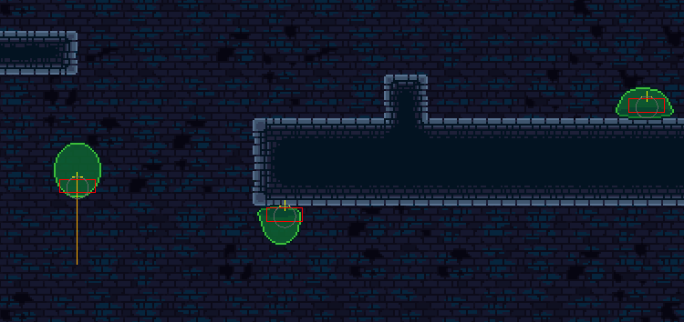

# Deceptus Engine Lua Interface

The Deceptus Engine comes with an interface written in Lua that lets you define the visuals and behavior of enemies inside the game.
The decision to go for Lua has been made as non-C++ programmers should be able to create their own enemies. Also creating or changing the behavior of enemies should be possible without making any change in the game engine.


# Creating Your First Own Enemy

Implementing your own enemy isn't rocket science. You have a function (a chunk of code) called `update`. That function is invoked by the game engine every frame.
So every frame you can decide whether you want to move left, right, jump, shoot or whatever action that seems suitable. This is basically how all AIs work: Look around you, decide what's the best thing to do and act upon it.

Before reading any further - yes, you will have to have some basic understanding of the Lua programming language. There's heaps of information on the web. To get started, just check out lua.org: https://www.lua.org/pil/1.html

## Setting Up Your Enemy

### Set Up Your Script

The first thing to do is to create a new `lua` file, e.g. `tutorial.lua`, inside the folder `scripts/enemies`.
Reference this file inside inside your `level.json` and set up a reasonable start position.

```json
  "enemies": [
    {"script": "tutorial.lua", "startposition": [50, 50]}
  ]
```

Now edit `tutorial.lua` and add an empty implementation for the absolute minimum functionality a Lua script can have:

```lua
function initialize()
   print("tutorial.lua initialized")
end
```

```lua
function update(dt)
end
```

Now, when you start the game and load your level, you should see the output 'tutorial.lua initialized' in the game's debug output.
That means the script has been loaded correctly. The next thing to do is to start implementing the actual 'business logic'.


### Initializing Your Script

Your first chore when initializing your script is to tell the Deceptus Engine how the shape of your character looks like. So you're saying whether your character looks more like a circle, a box or has a more complex shape. This information is then used by the engine for e.g. collision detection or shading. So it does make sense to use a reasonable amount of detail when it comes to defining the shape of your enemy and not just say 'well, a box is probably good enough'. Be as accurate as needed but also don't use a polygon with a thousand points.

You can also use a combination of shapes such as circles and rectangles:
```lua
-- since all information is passed to the physics engine, all positions below
-- are entered in meters.
addShapeCircle(0.12, 0.0, 0.12)    -- radius, x, y
addShapeRect(0.2, 0.07, 0.0, 0.1)  -- width, height, x, y
```

Now, as your enemy has a _body_, it is time to make sure that you are actually able to see it. In order to do so, you have to do two things:

First, create a `properties` table inside your script and define your enemy's sprite in there:
```lua
properties = {
   sprite = "data/sprites/enemy_my_sprite.png",
}
```

Then you should tell the engine, what area inside the sprite it should render. Later on, you might write code that updates the enemy's appearance every frame, but for now it is fine to do it just once:
```lua
SPRITE_WIDTH = 6 * 24
SPRITE_HEIGHT = 3 * 24

updateSpriteRect(0, 0, 0, SPRITE_WIDTH, SPRITE_HEIGHT) -- id, x, y, width, height
```

When you now start the game, you should see your enemy at its predefined start position. When you press the key `F1`, you are able to see your enemy's physics representation and velocity.




### Bringing Your Script to Life

Now it's time to let your enemy move around, attack or do whatever you think it should be doing. For this purpose, it's time to take a closer look at the `update` function you defined earlier.

In topics like real-time rendering or game development it is very common to have a function that's called every frame to update your data or model or whatever you want to call what you are maintaining internally. This function is usually called with a 'delta time' (`dt`) - the time that has passed since the last time the function has called. That helps you to write code that produces rather constant output. So no matter if your `frames per second` value drops a little - if you always multiple `dt` into your calculations, the output of your computations will remain the same.

So what to do inside the `update` call? It's really up to you and totally depends on what kind of character you like to implement. What I recommend doing though, is to split up the function into steps like
- `think()` - a function that evaluates the environment and decides on what to do next
- `act()` - a function that actually carries out what has been just decided

Here's an example for a typical `think` function:
```lua
function think()

   nextAction = mCurrentAction

   -- These are the actions you can choose from. E.g., if the player is nearby
   -- canAttack will return true and your next action will be 'Attack'. Until
   -- the player is around, you will probably just walk from A to B ('Walk'),
   -- wait a little ('Idle') and then walk back from B to A.
   if (isDead()) then
      nextAction = Action["Die"]
   elseif (canAttack()) then
      nextAction = Action["Attack"]
   elseif (isHit()) then
      nextAction = Action["Hit"]
   elseif (not isWaiting()) then
      nextAction = Action["Walk"]
   else
      nextAction = Action["Idle"]
   end

   mChanged = nextAction ~= mCurrentAction
   mCurrentAction = nextAction
end
```

Your `act` function will look very similar:
```lua
function act()

   if (mCurrentAction == Action["Hit"]) then
      updateHit()
   elseif (mCurrentAction == Action["Die"]) then
      updateDead()
   elseif (mCurrentAction == Action["Walk"]) then
      walk()
   elseif (mCurrentAction == Action["Attack"]) then
      attack()
   end

end
```

Those are the basics. Of course the details are still missing so the next chapter will cover a bit about how to use the API.


## Using the API

### Retrieving Positions

The first thing you probably want to know is '_Where is the player?_' , '_Where am I?_'. There are two functions that you will have to add to your script to get this information.

The first one is `playerMovedTo` which will give you the latest pixel coordinates of the player.
```lua
function playerMovedTo(x, y)
   print(string.format("player moved to: %f, %f", x, y))
   mPlayerPosition = v2d.Vector2D(x, y)
end
```

You can compare these ones with your own coordinates that you can retrieve as shown below:
```lua
function movedTo(x, y)
   print(string.format("moved to: %f, %f", x, y))
   mPosition = v2d.Vector2D(x, y)
end
```


### Moving the Enemy
So if the player is on your left (`player.x` is smaller than `enemy.x`), you might want to walk to the left. If the distance to the player is below a certain threshold, you might want to attack... or hand him flowers. Who knows.

How can you make your enemy move? For that purpose, you can set the velocity and acceleration via its properties and then just emit simple keyboard events for your movement:

Set the velocity and acceleration
```lua
   velocity_walk_max = 1.0,
   acceleration_ground = 0.1
```

Emit keyboard events to the engine to make it
```lua
function goLeft()
   keyReleased(Key["KeyRight"])
   keyPressed(Key["KeyLeft"])
end
```

```lua
function goRight()
   keyReleased(Key["KeyLeft"])
   keyPressed(Key["KeyRight"])
end
```

Alternatively, you can set the linear velocity directly by calling `setLinearVelocity`.

You can even go full hard core, totally ignore the concept of velocity and acceleration and set the enemy's position directly using `setTransform`.


### Paths

In the level design documentation's chapter about enemies you might have seen a paragraph about paths you can set for enemies.

In order to use these paths, you have to implement the function `setPath` sends a bunch of x, y positions in pairs.

Here's an example:

```lua

mPatrolPath = {}

function setPath(name, table)

   local i = 0
   local x = 0.0;
   local y = 0.0;
   local v = {}

   for key, value in pairs(table) do

      if ((i % 2) == 0) then
         x = value
      else
         y = value
         v[(i - 1) / 2] = v2d.Vector2D(x, y)
      end

      i = i + 1
   end

   if (name == "path") then
      mPatrolPath = v
   end
end
```

There's a `interpolation.lua` inside the `scripts/enemies` directory. Use that to interpolate between your path positions if needed. There are also a bunch of examples inside `scripts/enemies` that should serve as a good reference.


# The Lua API

## `addSample`

Preload a sample to be played later

|Parameter Position|Type|Description|
|-|-|-|
|1|string|Filename of the sample|


## `addShapeCircle`

Add a circle shape to the node

|Parameter Position|Type|Description|
|-|-|-|
|1|float|Circle radius (meters)|
|2|float|Circle x-position (meters)|
|3|float|Circle y-position (meters)|


## `addShapeRect`

Add a rectangular shape to the node.

|Parameter Position|Type|Description|
|-|-|-|
|1|float|Rect width (in meters)|
|2|float|Rect height (in meters)|
|3|float|Rect position x (in meters)|
|4|float|Rect position y (in meters)|


## `addShapePoly`

Add a polygonal shape to the node.

|Parameter Position|Type|Description|
|-|-|-|
|n|float|x-coordinate (in meters)|
|n+1|float|y-coordinate (in meters)|


## `addSprite`

Add another (empty) sprite to this node


## `addWeapon`

Add a weapon instance to the player

```cpp
enum class WeaponType
{
   Default = 0,
   Bow = 1,
};
```

|Parameter Position|Type|Description|
|-|-|-|
|1|enum class `WeaponType`|Weapon type|
|2|int32_t|Fire interval (in ms)|
|3|int32_t|Damage for single hit (0..100)|
|4|float|Bullet radius (in meters)|
|4..n|float|Polygon x and y parameters (in meters) if not a radial bullet|


## `boom`

Let's the game's camera shake.

|Parameter Position|Type|Description|
|-|-|-|
|1|int32_t|Detonation center x (in px)|
|2|int32_t|Detonation center y (in px)|
|3|float|Boom intensity (0..1)|


## `damage`

The node passes a certain amount of damage to the player.

|Parameter Position|Type|Description|
|-|-|-|
|1|int32_t|amount of damage from 0..100|
|2|float|damage direction-x (in meters)|
|3|float|damage direction-y (in meters)|


## `damageRadius`

The node damages the palyer if he's within a given radius.

|Parameter Position|Type|Description|
|-|-|-|
|1|int32_|amount of damage from 0..100|
|2|float|damage direction-x (in meters)|
|3|float|damage direction-y (in meters)|
|4|float|radius damage radius|


## `debug`

Output a debug message to stdout

|Parameter Position|Type|Description|
|-|-|-|
|1|string|Debug message|


## `die`

This will let the enemy instance die. The object gets deleted and will no longer be called.


## `fireWeapon`

This will fire a weapon from a given position into a given direction.

|Parameter Position|Type|Description|
|-|-|-|
|1|int32_t|Index of the weapon|
|2|int32_t|x-position where the shot comes from (in px)|
|3|int32_t|y-position where the shot comes from (in px)|
|4|float|x-direction (in meters)|
|5|float|y-direction (in meters)|


## `getLinearVelocity`

Reads the linear velocity of this object.

|Parameter Position|Type|Description|
|-|-|-|
|Returns|lua table|1 is the linear velocity in x (in meters)<br>2 is the linear velocity in y (in meters)|


## `isPhsyicsPathClear` [deprecated]

Check if a given path hits objects inside the physics information of the game.

Use `queryRayCast` instead.

|Parameter Position|Type|Description|
|-|-|-|
|1|int32_t|Ray start x-position (in px)|
|2|int32_t|Ray start y-position (in px)|
|3|int32_t|Ray stop x-position (in px)|
|4|int32_t|Ray stop y-position (in px)|
|Return|bool|Returns `true` on collision|


## `makeDynamic`

Makes the object 'dynamic'

A dynamic body is fully simulated. They can be moved manually by the user, but normally they move according to forces. A dynamic body can collide with all body types. A dynamic body always has finite, non-zero mass. If you try to set the mass of a dynamic body to zero, it will automatically acquire a mass of one kilogram and it won't rotate.


## `makeStatic`

Makes the object 'static'.

A static body does not move under simulation and behaves as if it has infinite mass. Internally, Box2D stores zero for the mass and the inverse mass. Static bodies can be moved manually by the user. A static body has zero velocity. Static bodies do not collide with other static or kinematic bodies.


## `playDetonationAnimation`

Play a detonation animation

|Parameter Position|Type|Description|
|-|-|-|
|1|int32_t|Detonation center x (in px)|
|2|int32_t|Detonation center y (in px)|


## `playSample`

Plays a given sample

|Parameter Position|Type|Description|
|-|-|-|
|1|string|Filename of the sample to play|
|2|float|Volume (0..1)|


## `queryAABB`

Query the world for all fixtures that potentially overlap the provided AABB.

|Parameter Position|Type|Description|
|-|-|-|
|1|float|aabb x1|
|2|float|aabb y1|
|3|float|aabb x2|
|4|float|aabb y2|
|return|int32_t|The amount of hits within the AABB|

## `queryRayCast`

Ray-cast the world for all fixtures in the path of the ray.

The ray-cast ignores shapes that contain the starting point.

|Parameter Position|Type|Description|
|-|-|-|
|1|int32_t|start x-position of your ray (in px)|
|2|int32_t|start y-position of your ray (in px)|
|3|int32_t|end x-position of your ray (in px)|
|4|int32_t|end y-position of your ray (in px)|
|return|int32_t|number of objects hit by the ray|


## `registerHitAnimation`

Register a hit animation for a given weapon

|Parameter Position|Type|Description|
|-|-|-|
|1|int32_t|Weapon index|
|2|string|Texture path|
|3|int32_t|Width of one frame (in px)|
|4|int32_t|Height of one frame (in px)|
|5|int32_t|Frame count|
|6|int32_t|Frames per row|
|7|int32_t|Start frame|


## `setActive`

Set this node active/inactive.
An inactive body is not simulated and cannot be collided with or woken up.

|Parameter Position|Type|Description|
|-|-|-|
|1|bool|Active flag|


## `setDamage`

Set the damage property of this lua node.
This will let the game's collision management know how much damage the player should retrieve on collision with the object.

|Parameter Position|Type|Description|
|-|-|-|
|1|int32_t|Amount of damage (0..100)|


## `setGravityScale`

Set the gravity scale of this node.

|Parameter Position|Type|Description|
|-|-|-|
|1|float|Gravity scale (-1..1), -1 is inverted, 0 is 'no gravity', 1 is normal|


## `setLinearVelocity`

Sets the for linear velocity of this node

|Parameter Position|Type|Description|
|-|-|-|
|1|float|Velocity x (in meters)|
|2|float|Velocity y (in meters)|


## `setSpriteOffset`

Sets the offset for a given sprite

|Parameter Position|Type|Description|
|-|-|-|
|1|int32_t|Sprite id|
|2|int32_t|x-position (in px)|
|3|int32_t|y-position (in px)|


## `setSpriteOrigin`

Set the origin of a given sprite

|Parameter Position|Type|Description|
|-|-|-|
|1|int32_t|Sprite id|
|2|int32_t|x-position (in px)|
|3|int32_t|y-position (in px)|


## `setTransform`

Set the object's transform

|Parameter Position|Type|Description|
|-|-|-|
|1|int32_t|x-translation (in px)|
|2|int32_t|y-translation (in px)|
|3|float|z-rotation (in radians)|


## `setZ`

Set the z layer of this node.

|Parameter Position|Type|Description|
|-|-|-|
|1|int32_t|z layer|


## `timer`

Starts a timer for a given amount of milliseconds. When the time is elapsed the timeout callback will be called:

```lua
function timeout(id)
   print(string.format("timeout: %d", id))
end
```

|Parameter Position|Type|Description|
|-|-|-|
|1|int32_t|Delay of the timer|
|2|int32_t|Id of the timer in milliseconds|


## `updateKeysPressed`

Send keypressed events to the node instance which will then be processed by the game engine.

|Parameter Position|Type|Description|
|-|-|-|
|1|int32_t|Keypressed bitmask|


## `updateProjectileAnimation`

Configure the projectile animation for a given weapon

|Parameter Position|Type|Description|
|-|-|-|
|1|int32_t|Weapon index|
|2|string|Texture path|
|3|int32_t|Width of one frame (in px)|
|4|int32_t|Height of one frame (in px)|
|5|int32_t|x-origin of the frame (in px)|
|6|int32_t|y-origin of the frame (in px)|
|7|float|Time for each frame in seconds|
|8|int32_t|Frame count|
|9|int32_t|Frames per row|
|10|int32_t|Start frame|


## `updateProjectileTexture`

Change the texture of a projectile

|Parameter Position|Type|Description|
|-|-|-|
|param 1|int32_t|Index of the weapon|
|param 2|string|Path of the texture|
|param 3|int32_t|x-position of the texture rect (in px)|
|param 4|int32_t|y-position of the texture rect (in px)|
|param 5|int32_t|Width of the texture rect (in px)|
|param 6|int32_t|Height of the texture rect (in px)|


## `updateProperties`

Update a number of properties by providing a key and value.

|Parameter Position|Type|Description|
|-|-|-|
|1|string|key|
|2|variant|value|
|n|string|key|
|n + 1|variant|value|


## `updateSpriteRect`

Update the sprite rectangle for a particular sprite.

|Parameter Position|Type|Description|
|-|-|-|
|1|int32_t|id of the sprite|
|2|int32_t|x-position of the rectangle within the sprite (in px)|
|3|int32_t|y-position of the rectangle within the sprite (in px)|
|4|int32_t|Rectangle width (in px)|
|5|int32_t|Rectangle height (in px)|

